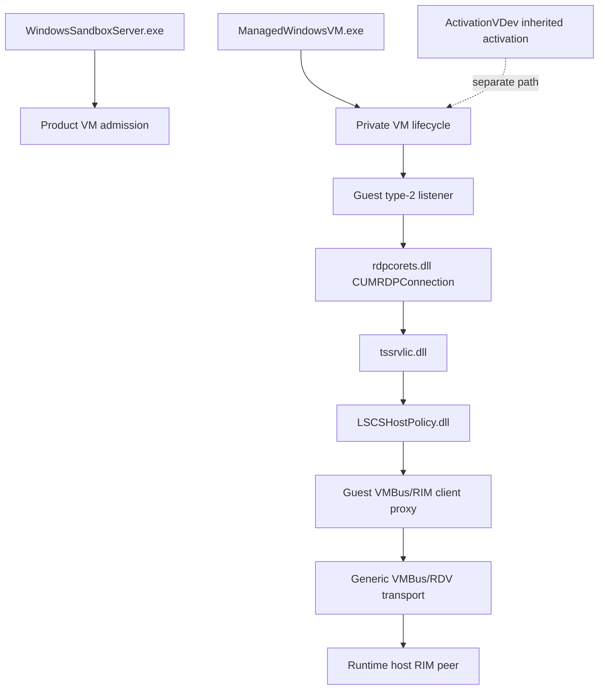

# Windows Sandbox component and registration catalog

This catalog assigns each examined component a narrow role and records the evidence boundary for
that assignment. It is intended to prevent nearby RDP, VMBus, and licensing components from being
mistaken for one another.

## Process and server catalog

| Component | Plane | Verified responsibility | Explicit non-role |
| --- | --- | --- | --- |
| `WindowsSandboxServer.exe` | Product orchestration | Per-user Sandbox gRPC service on `\\.\pipe\wsandbox\<MD5(user SID)>`; can make product-level VM-admission decisions | VM engine, guest RDP server, final LSCS policy receiver |
| `ManagedWindowsVM.exe` | VM lifecycle | Out-of-process WinRT server for `WindowsUdk.Security.Isolation.ManagedWindowsVM`; drives private Container Manager operations | Standalone replacement for the privileged backend or licensing policy |
| `CmService` / `cmproxyd.exe` | Container Manager lifecycle proxy | HCS reports direct VMs as `WindowsSandbox`-owned clones of a `CmService` template; `CmService` creates a per-VM `cmproxyd` process | LSCS receiver; the proxy has RPC/HTTP/WSHHyperV modules but no RDV or VMBus module |
| `vmcompute.exe` | Hyper-V compute | Builds VM configuration, recognizes internal `VirtualMachine/Devices/Licensing` resource, and starts/controls workers | Statically attributable implementation of `ILSClientService` |
| `vmwp.exe` | Per-VM worker | Reads the VDEV manifest and activates each selected VDEV through `CoCreateInstance(..., IID_IVirtualDevice)`; its conventional VDEV registry catalog has no LSCS marker | Statically attributable implementation of `ILSClientService` |
| `sppsvc.exe` | Software Protection Platform | Processes Activation VDEV inherited-activation messages through `SLSProcessVMPipeMessage` | Active LSCS receiver in the tested direct desktop flow |
| Guest Terminal Services | Guest RDP server | Loads the hard-coded VM listener through `termsrv.dll` and receives the accepted RDP connection | Host RDV bridge or Enhanced Mode VDEV |

The final host implementation requested through `IID_ILSClientService` remains dynamically
unattributed. Absence from a static image is not proof that the process is uninvolved.

## Guest RDP and licensing modules

| Module | Verified responsibility | Key evidence |
| --- | --- | --- |
| `termsrv.dll` | Starts VM listener type `2` for VMBus and type `3` for HVSock; selects the built-in listener license route | `CRemoteConnectionManager::StartStopHardcodedListeners` and `StartVMListener` |
| `rdpcorets.dll` | Registered `UMRDPProtocolManager`; implements `CUMRDPListenerVMBus`, `CUMRDPListenerInet`, and `CUMRDPConnection` | Both accept paths create `CLSID_UMRDPConnection` |
| `rdpbase.dll` | Shared RDP base factory and platform infrastructure | `rdpcorets.dll` resolves `RDPBASE_CreateInstance` |
| `vmbuspipe.dll` | Generic offered-channel and notification API used by the VMBus listener | Dynamically loaded by `CUMRDPListenerVMBus` |
| `vmbuspiper.dll` | Related generic VMBus-pipe client/server component | Not the notification DLL selected by the examined listener |
| `tssrvlic.dll` | Role-4 DVM proxy licensing provider | `CDVMProxyLicenseLibrary` and `CProxyPolicy` selection |
| `LSCSHostPolicy.dll` | Guest-side client adapter for the private host policy request | `CHostPolicy::HostProcessData` obtains a RIM proxy after `ConnectToParentPartition`, then forwards to `IID_ILSClientService` |

## Host VDEV modules

| Module | Registered or observed role | Relationship to direct Sandbox desktop |
| --- | --- | --- |
| `vmicrdv.dll` | Registered `Msvm_RdvComponent` VDEV | RDV bridge used by the direct guest connection |
| `vmrdvcore.dll` | Generic RDV endpoint and VMBus transport | Its `OfferChannel` recognizes the LSCS instance and selects the LSCS type before offering; no `IID_ILSClientService` or policy sink |
| `rdvvmtransport.dll` | RDV transport dependency | Same generic LSCS offer selector as `vmrdvcore.dll`; no static LSCS policy implementation |
| `vmbusvdev.dll` | Core VMBus VDEV | Opens the worker's VMBus device and exposes generic `IVMBusTransport` to other VDEVs; no LSCS/RIM policy code |
| `ActivationVDev.dll` | Registered `CSppActivationVDev` VDEV | Inherited application/OS activation through CLIP and its own fixed VMBus-pipe service; strongly disfavored as the direct LSCS sink |
| `vmuidevices.dll` | Hyper-V Synthetic RDP and RDP Encoder VDEVs | Separate Enhanced Mode stack |
| `rdp4vs.dll` | RDP4VS engine loaded by `vmuidevices.dll` | Enhanced Mode graphics/input path, not the guest LSCS bridge |

The VDEV relationship is not a licensing ownership relationship. In particular, neither
`vmuidevices.dll` nor `rdp4vs.dll` contained the LSCS endpoint markers or
`IID_ILSClientService`.

## Registrations and private identifiers

| Item | Value | Consumer | Significance |
| --- | --- | --- | --- |
| RDP protocol-manager CLSID | `{5828227C-20CF-4408-B73F-73AB70B8849F}` | `Wds\rdpwd` `LoadableProtocol_Object` | Registered as `UMRDPProtocolManager` from `rdpcorets.dll` |
| Ordinary listener key | `HKLM\SYSTEM\CurrentControlSet\Control\Terminal Server\WinStations\RDP-Tcp` | `CUMRDPListenerInet` | Configures TCP-specific listener behavior |
| RDV VDEV class ID | `{6C5ADDB9-A11A-4E8E-84CB-E6208201DB63}` | `vmicrdv.dll` | Maps `Msvm_RdvComponent` to the RDV VDEV |
| Activation VDEV class ID | `{BC12C717-8898-4688-8EE4-2CD14894F8EA}` | `ActivationVDev.dll` | Maps `CSppActivationVDev` to the inherited-activation VDEV |
| Activation VDEV instance ID | `{4487B255-B88C-403F-BB51-D1F69CF17F87}` | `ActivationVDev.dll` | Does not match either LSCS RDV endpoint GUID |
| Activation VMBus-pipe service | `{3375BAF4-9E15-4B30-B765-67ACB10D607B}` | `ActivationVDev.dll` | Separate fixed VMBus-pipe service; not the LSCS endpoint type |
| RDP Encoder VDEV class ID | `{9CB98DB1-4D09-4538-A192-2D3D8C0B6CDB}` | `vmuidevices.dll` | Enhanced Mode encoder registration |
| Synthetic RDP VDEV class ID | `{9ED5FD4B-40C3-4DE3-8597-98ECD17035DA}` | `vmuidevices.dll` | Enhanced Mode synthetic RDP registration |
| LSCS endpoint | `RdvVmEndPointLSCS` | `LSCSHostPolicy.dll`; generic RDV offer code | Private guest-to-host policy request; the generic transport maps its fixed instance to its fixed endpoint type |
| LSCS interface | `{B3461E73-AE5B-465B-8BDB-42BC5E87F22C}` | `LSCSHostPolicy.dll` | Requested `IID_ILSClientService` interface |

The SynthRDP listener identifiers are documented separately because they are private per-build
transport details, not system registrations. See
[the SynthRDP control handoff](windows-sandbox-synthrdp-control.md).

## Decision ownership map

The generic RDV transport has a static LSCS offer selector, but its built-in endpoint initialization
does not create LSCS. A successful direct connection left host `TermService` and `vmicrdv` stopped,
so neither of their ordinary service paths is the active receiver on this build. The only observed
caller-controlled step in this map is whether the product gRPC route or direct lifecycle route asks
Windows to create a VM. Both routes converge on the same guest listener and host-mediated
desktop-admission decision. The VDEV manifest framework remains a possible dynamic host boundary,
but the ordinary `VirtualDevices` class/interface catalog does not advertise LSCS. The separate
Activation VDEV reaches `sppsvc.exe`, whose handler and observed stopped state during desktop
admission exclude that activation path from the LSCS decision.

## Version and confidence boundary

The catalog combines guest artifacts and locally examined `10.0.26100` host binaries. The full
per-file version list and evidence classifications are maintained in
[the evidence matrix](windows-sandbox-evidence.md). Treat exact private identifiers as version
scoped and revalidate them after Windows servicing changes.
