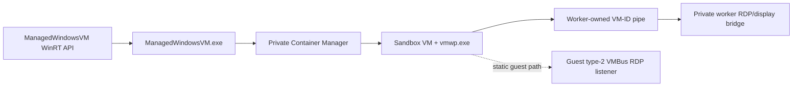

# Direct Windows Sandbox VM lifecycle

`ironrdp-wsb` explores a Windows Sandbox lifecycle route that does not ask
`WindowsSandboxServer.exe` to create the VM. It is useful for research and controlled testing, but
it remains a private, version-sensitive API boundary.

## Entry point

The private WinRT class is:

```text
WindowsUdk.Security.Isolation.ManagedWindowsVM
```

The installed out-of-process implementation is:

```text
C:\Windows\System32\ManagedWindowsVM.exe
```

Static analysis and runtime inspection show that this server uses private Container Manager
(`Cms*`) APIs to create and run the underlying container. The direct path invokes the existing
privileged implementation; it does not replace the VM engine, Hyper-V worker, guest image, or
licensing implementation.



## Runtime access constraint

The UDK WinRT projection depends on the Windows Sandbox runtime. On the tested host, loading the
installed runtime from an unpackaged process was blocked by the DLL's conditional executable-mapping
ACL, which requires the Windows Sandbox package identity:

```text
MicrosoftWindows.WindowsSandbox_cw5n1h2txyewy
```

`SandboxRuntime::initialize` in `ironrdp-wsb` makes the runtime requirement explicit. A copied
runtime DLL may be useful for diagnostics but is not a supported bootstrap or redistribution
strategy. Calling `WindowsAppRuntime_EnsureIsLoaded` does not remove the identity check.

## Capability boundary

The `ManagedWindowsVM` object exposes private lifecycle-oriented operations. The research harness
successfully used the existing implementation to:

- create multiple direct Sandbox VM instances;
- retain a running reference while a VM is in use;
- configure NAT networking;
- configure Hyper-V socket services;
- share a host folder with the guest;
- start a guest process through the VM API;
- inspect guest network information; and
- terminate the exact VM it created.

Those results demonstrate lifecycle control only. They do not imply that every Windows Sandbox
feature, configuration XML option, shell integration, or entitlement behavior is available through
this ABI.

## Product-server comparison

| Concern | `WindowsSandboxServer.exe` route | Direct `ManagedWindowsVM` route |
| --- | --- | --- |
| Caller interface | Per-user Sandbox gRPC service | Private WinRT projection |
| VM admission | Product-level policy applies before creation | Avoids only this product orchestration step |
| Privileged create/run backend | Product-private provisioning path; its exact lower call chain is not fully attributed | `ManagedWindowsVM.exe` and private Container Manager |
| Guest customization | Product server handles its normal provisioning policy | Caller must use only exposed VM operations |
| Connection data | Server can return Sandbox RDP configuration | Caller needs its own known transport and credentials |
| Worker RDP bridge | Product private configuration | Same `vmwp`-owned VM-ID pipe and RDP/display stack |
| Guest desktop admission | Guest LSCS/RDV route | Same statically established LSCS/RDV route |

This distinction is important when interpreting concurrency. Direct lifecycle creation allowed
several VM instances to run concurrently. Current two-VM desktop repros first connected both
sessions, then observed either an RDP display-driver startup error or a server-reported logoff.
Neither outcome is correlated to a guest LSCS call in the current traces. See
[RDP and RDV transport](windows-sandbox-rdp-transport.md).

## Guest account identity

Each Sandbox VM has its own guest SAM database. The product server does not share one interactive
user object across concurrent VMs; it only chooses which local account to activate or create inside
that guest.

Product `SandboxVM.SetUpUserAccount` does the following after the UDK VM is running:

1. If the recipe `Username` is empty, use `ManagedWindowsVM.DefaultUserName`.
2. If the recipe `Password` is empty, generate a fresh GUID password.
3. If the selected name equals `DefaultUserName`, run `net user` / `net user /active:yes` and
   `wcsetupagent.exe AddUserToUsersGroup` against that default account.
4. Otherwise run `net user <name> <password> /add` to create a custom local account.
5. Always finish with `wcsetupagent.exe AddUserToAdminGroup` for the selected name.

On the tested image family, `DefaultUserName` is `WDAGUtilityAccount`. That string is therefore the
common default login name across many Sandboxes, but each VM still has a distinct guest account with
its own password and profile path.

Controlled direct-lifecycle harnesses exercised both patterns:

| Multi-VM setup | Guest usernames | Result relevance |
| --- | --- | --- |
| Default-account trio | `WDAGUtilityAccount` on every VM, distinct per-VM passwords | Multiple VMs run; concurrent desktop failures still appear |
| Custom-account trio | `IrdpVm1`, `IrdpVm2`, `IrdpVm3` | Multiple VMs run; concurrent desktop failures still appear |

So different guest users are possible and already used in testing. Same-versus-different usernames
is not the proven root cause of the current cross-VM post-connect failures. The same-VM two-client
control is separately explained by the worker RDP encoder's local replacement path and does not
depend on guest-account uniqueness.

## IronRDP usage

The product-facing implementation intentionally splits responsibilities:

- [`ironrdp-wsb`](../../crates/ironrdp-wsb) owns narrow experimental lifecycle bindings and cleanup.
- [`ironrdp-agent`](../../crates/ironrdp-agent) keeps the product-supported
  `WindowsSandboxServer.exe` gRPC route and can connect through a known Sandbox named pipe.
- The RDP client stays responsible for the standard RDP session after the Windows-provided
  transport is available.

No crate is intended to emulate the private Windows Sandbox server, alter package identity, or
replace host licensing policy.

## Evidence and limitations

- The direct path was exercised against the `10.0.26100` Windows component family.
- The checked-in projection is deliberately small and generated from the installed UDK metadata so
  CI does not need private Windows metadata.
- The ABI can change with any Windows update. A successful call is not an interoperability guarantee.
- The same private runtime, package identity, OS feature state, and host policy remain prerequisites.

See [evidence and version matrix](windows-sandbox-evidence.md) for source versions and confidence
levels.
