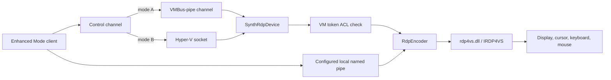

# Hyper-V Enhanced Mode virtual devices

`vmuidevices.dll` is a Hyper-V worker virtual-device module. It has no LSCS endpoint or
`IID_ILSClientService` marker, but an elevated Sandbox-worker capture showed it is loaded in the
same process that owns `\\.\pipe\{VM-ID}`.

This distinction matters because both the guest type-2 listener and the worker VDEV stack are
RDP-related, while only the guest route statically exposes the LSCS bridge.

## Registered VDEVs

On the tested host, `vmuidevices.dll` registers these default virtual devices:

| VDEV | Class ID | Registry display name |
| --- | --- | --- |
| RDP Encoder | `{9CB98DB1-4D09-4538-A192-2D3D8C0B6CDB}` | `Microsoft|RdpEncoder|V1.0` |
| Synthetic RDP Device | `{9ED5FD4B-40C3-4DE3-8597-98ECD17035DA}` | `Microsoft|SynthRdp|V1.0` |

The examined module was `vmuidevices.dll` version `10.0.26100.8457`. It dynamically loads
`rdp4vs.dll` version `10.0.26100.5074`.

## Worker activation and COM loading

The Sandbox worker does not hard-code a `vmuidevices.dll` path in its VM image. Static
`vmwp.exe` analysis shows that it builds a VDEV manifest from the VM repository,
reads class metadata from
`HKLM\SOFTWARE\Microsoft\Windows NT\CurrentVersion\Virtualization\VirtualDevices`, then creates
each selected device with:

```text
CoCreateInstance(VDEV CLSID, IID_IVirtualDevice)
```

For the two RDP VDEVs, normal COM registration maps that activation to
`C:\Windows\System32\vmuidevices.dll` with `ThreadingModel=Free`:

| VDEV | CLSID | COM ProgID | VDEV catalog detail |
| --- | --- | --- | --- |
| RDP Encoder | `{9CB98DB1-4D09-4538-A192-2D3D8C0B6CDB}` | `RdpEncoderVdev.1` | Catalog interface `{1F490E46-8AD0-468D-8359-BA9D57FE9CC8}`; `RdpEncoder::InnerQueryInterface` exposes the same private contract |
| Synthetic RDP Device | `{9ED5FD4B-40C3-4DE3-8597-98ECD17035DA}` | `SynthRdpVdev.1` | No additional interface GUID is declared in the examined VDEV catalog entry |

The contract is private: the RDP Encoder interface GUID is not registered under `HKCR\Interface`.
The `SynthRdpDevice` service-dependency declaration names an `IRdpEncoder` dependency, consistent
with the repository supplying the encoder's private interface to the synthetic device.

The VDEV framework injects dependencies when it invokes each `IVirtualDevice::Initialize`:

| VDEV | Recovered service dependencies |
| --- | --- |
| `RdpEncoder` | `ISecurityManager`, `IVmRdpServices`, `IVmHandleBrokerServices`, `IVmTimeSource`, optional `IVmInputController` |
| `SynthRdpDevice` | `IRdpEncoder`, `IVmbusServices`, `IVmRdpServices`, `IVmHandleBrokerServices`, `IVmTimeSource` |

This explains how the worker finds and loads the VDEVs, but the direct Sandbox VM's per-VM manifest
is not exposed through the ordinary Hyper-V WMI associations. It remains unknown which specific
manifest entry binds `\\.\pipe\{VM-ID}` to which listener.

### Compute-side VDEV configuration

`vmcompute.exe` confirms that both VDEVs are intentional parts of the same private graph:

```text
VIDEO_MONITOR_DEVICE_ID
  -> RDP_ENCODER_DEVICE_ID
  -> INPUT_MANAGER_DEVICE_ID

SYNTHRDP_DEVICE_ID
  -> RDP_ENCODER_DEVICE_ID
  -> IC_GUESTINTERFACE_DEVICE_CLASS_ID
```

The recovered IDs for the two relevant VDEVs are the registered RDP Encoder
`{9CB98DB1-4D09-4538-A192-2D3D8C0B6CDB}` and Synthetic RDP
`{9ED5FD4B-40C3-4DE3-8597-98ECD17035DA}`. Thus a VM configured with SynthRDP necessarily also
gets the encoder; its presence in a worker does not identify the pipe listener by itself.

The compute service separately calls `ConfigureRdpEncoder` and `ConfigureSynthRdp` when building
the worker configuration. Each can consume a private/public RDP connection-options record
containing a pipe name and access-SID list. If that record supplies a name, the shared
`CreateRdpConnectionNamedPipe` helper:

1. builds a DACL for the configured access SIDs, the VM SID, and a fixed RDP capability SID;
2. calls `CreateNamedPipeW` with duplex, overlapped I/O, up to 255 instances, and 32 KiB input and
   output buffers; and
3. transfers the resulting server handle through the relevant VDEV handle broker.

This explains why the eventual `\\.\pipe\{VM-ID}` handle is owned by `vmwp.exe` even though its
creation originates in the compute-service configuration path. It also means the pipe name is a
runtime configuration value, not an embedded literal in either VDEV DLL.

The public HCS schema exposes `RdpConnectionOptions` on both `VideoMonitor` and
`EnhancedModeVideo`. The examined UDK `VMOptions` surface does not expose either setting, and a
read-only `HcsGetComputeSystemProperties` query on a direct Sandbox VM returns only basic runtime
properties. No VM-scoped configuration file containing the test VM ID was found in the known
Container or Hyper-V stores while the VM was running. The native backend therefore remains the
owner of the default connection-options values.

## Synthetic RDP connection flow



`SynthRdpDevice::PowerOn` selects a `VmbusPipeControlChannel` or `HvSocketControlChannel`.
For the VMBus variant, the control path creates a session and offers a new VMBus channel. The
Hyper-V socket variant creates an HVSock and associates it with asynchronous I/O.

## Feature gate

`SynthRdpDevice::ConnectEnhanced` reads the machine-local Enhanced Mode setting. If the setting is
disabled, the device rejects the request with `E_ACCESSDENIED` and records that the policy setting
is not enabled.

`SynthRdpDevice::IsEnhancedModeAvailable` additionally requires:

1. a ready device state;
2. the Enhanced Mode setting to be enabled; and
3. the Azure feature-set mode to be disabled.

This is an Enhanced Mode feature gate. It is not a Terminal Services license-count policy.

## Caller authorization

Before creating a synthetic RDP data connection, the device converts the presented token into an
ACL authorization context and checks access to the VM's view/input access object:

```text
AuthorizationUtilities -> ACL context -> AuthFAccessObjectTypeVirtualMachine access check
```

A failed check produces the diagnostic equivalent of "User is not authorized to connect to this
VM." The encoder independently obtains an authorization/policy engine before initializing each
remote connection; a failure there is also an access-control failure, not a license decision.

## Local named-pipe paths and the VM-ID pipe

Both VDEVs can bind configured local named-pipe listeners:

- `SynthRdpDevice` forwards an accepted pipe to its active control channel.
- `RdpEncoder` initializes RDP4VS, queries `IID_IRDP4VSNamedPipe`, and hands it the accepted pipe.

An elevated handle capture proved that the Sandbox `vmwp.exe` worker owns
`\\.\pipe\{VM-ID}`. The same worker loads `vmuidevices.dll`, `rdp4vs.dll`, `RDPBASE.dll`, and
`RDPSERVERBASE.dll` after a desktop connection. This is strong evidence that the VM-ID pipe enters
the worker RDP/display bridge.

The capture did not identify which of the two VDEV listeners accepts the VM-ID pipe, so it does not
prove that the pipe is configured through the same listener object as an ordinary Enhanced Mode
pipe. The pipe must therefore remain described as a private worker bridge, not as a supported
Enhanced Mode API or a proven direct guest VMBus connection.

Static accept paths make the remaining attribution boundary precise:

| Listener that accepts a pipe | Recovered next step |
| --- | --- |
| `RdpEncoder` | `OnNamedPipeConnectionEstablished` calls `InitializeRdp4Vs`, creates `IID_IRDP4VS`, queries `IID_IRDP4VSNamedPipe`, and gives it the accepted handle |
| `SynthRdpDevice` | `OnNamedPipeConnectionEstablished` calls its `VmbusPipeControlChannel::Connect`; that allocates a `SynthRdpDataChannel`, establishes its VMBus-side RDP net stream through `IVmRdpServices`, then wraps the returned `IRDPENCNetStream` |

Both routes can therefore lead to later RDP4VS/RDP server activity. The direct connection's worker
module delta alone cannot identify which listener accepted `\\.\pipe\{VM-ID}`. A read-only accepted-
pipe call stack or kernel file-I/O stack is required to decide it.

### RDP4VS named-pipe split

`CRDP4VS::NonDelegatingQueryInterface` exposes `IID_IRDP4VSNamedPipe` as a distinct private
subobject. The recovered call paths use two different methods after the three `IUnknown` slots:

| Caller | Private named-pipe operation | Recovered effect |
| --- | --- | --- |
| `RdpEncoder::OnNamedPipeConnectionEstablished` | First method | `CRDP4VS::CreateRDPConnection(void*)`: creates an RDP stream from the accepted pipe and asks the internal RDP connector endpoint to create an RDP connection |
| `SynthRdpDataChannel::EstablishConnection` through `IRdpEncoder::CreateRDPStream` | Second method | `CRDP4VS::CreateRDPStreamInternal(void*, IRDPENCNetStream**)`: wraps its opaque pipe/context input in an `IRDPENCNetStream` for the SynthRDP VMBus/HVSock data channel |

The SynthRDP channel owns an injected `IRdpEncoder`. On a VMBus-pipe accept it calls the encoder's
stream-creation vtable method with the accepted handle and the pipe-mode flag. The encoder then
initializes RDP4VS named-pipe mode and invokes the second operation above. This explains why
`rdp4vs.dll` loads after a direct connection even if SynthRDP accepted the original pipe.

The strongest static inference is that the external VM-ID client pipe is the RDP Encoder-side
listener: the product named-pipe client is an RDP client that obtains an `IRDPENCNetStream`, while
the encoder's first operation explicitly creates an RDP connection. SynthRDP is then the internal
control/data bridge that obtains a stream from the encoder and carries it over VMBus/HVSock.
This is still an inference because the direct VM's private connection-options record is unavailable
to ordinary HCS queries and no accepted-pipe stack was captured.

### RDP4VS factory and interface sequence

`RdpEncoder::PowerOn` builds a `NamedPipeListenerBinding` when its private configuration supplies
a pipe path. That binding:

1. calls `LoadLibraryW(L"rdp4vs.dll")`;
2. resolves `RDP4VS_CreateInstance`;
3. requests `CLSID_RDP4VPCNamedPipeListener` as `IID_IRDP4VPCNamedPipeListener`; and
4. supplies a `NamedPipeListenerEventsProxy<RdpEncoder>`, the configured path, and the configured
   string list to start the listener.

When the listener reports an accepted pipe,
`RdpEncoder::OnNamedPipeConnectionEstablished` creates the main RDP4VS instance through a separate
`LoadLibraryW`/`GetProcAddress` sequence:

```text
RDP4VS_CreateInstance(CLSID_RDP4VS, IID_IRDP4VS, &instance)
  -> QueryInterface(IID_IRDP4VSNamedPipe)
  -> private named-pipe method(accepted pipe handle)
```

The encoder also passes display state, cursor/input settings, certificate/trusted-issuer
configuration, and its RDP4VS event sink through private `IRDP4VS` methods. The interface is
private, so the exact names of every vtable member after `IUnknown` are not a supported contract.

## RDP4VS and graphics

`RdpEncoder` loads `rdp4vs.dll`, resolves `RDP4VS_CreateInstance`, and creates `IRDP4VS`. Its
factory requests `RDPSERVERBASE_CreateInstance` before falling back to `RDPBASE_CreateInstance`.
It then configures RDP4VS with display state and certificate/trusted-issuer data before
establishing the stream.

The encoder owns:

- display invalidations and bitmap refresh;
- cursor position and shape updates;
- keyboard and mouse input, including AltGr handling;
- connection replacement when a later Enhanced Mode client connects; and
- teardown of RDP4VS and named-pipe state when the VDEV powers off.

`IRDP4VSEvents` callbacks reach `RdpEncoder::OnClientConnected`, `OnClientReady`, and
`OnClientDisconnected`. On connection, the encoder obtains authorization utilities from
`ISecurityManager`, converts the supplied `IAfSecurityInfo` token into an ACL context, and checks
`AuthFAccessObjectTypeVirtualMachine`. On ready, it calls RDP4VS's private
connection-control-state method for that connection.

The encoder also finds and terminates an existing `RemoteConnection` before accepting a replacement
connection in the same encoder instance. That is a per-worker/per-VM replacement path; it cannot
by itself enforce a limit across two distinct Sandbox `vmwp.exe` workers.

When configured for VAIL remoting-object security, `SynthRdpDevice` obtains the VM-associated
graphics object through `\\Device\\DxgKrnl` and sets a DACL for the worker token and configured
SIDs. This protects graphics/remoting resources; it is not the Sandbox desktop entitlement check.

## Why it is not the LSCS receiver

The following markers were absent from both `vmuidevices.dll` and its `rdp4vs.dll` dependency:

- `IID_ILSClientService`;
- `RdvVmEndPointLSCS`;
- the LSCS endpoint type GUID;
- `LSCSHostPolicy`; and
- RDV licensing endpoint names.

The guest type-2 listener statically selects a built-in license route and enters the LSCS/RDV
bridge. The worker RDP/display modules contain no LSCS marker, and their standard RDP wire
licensing code skips server licensing on non-server Windows. See
[RDP and RDV transport](windows-sandbox-rdp-transport.md) and
[licensing and desktop admission](windows-sandbox-licensing.md).
