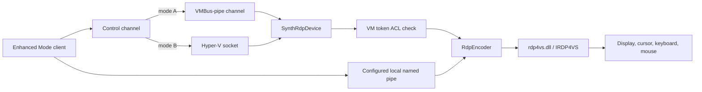

# Hyper-V Enhanced Mode virtual devices

`vmuidevices.dll` is a Hyper-V worker virtual-device module. It is RDP-related, but it is not the
Windows Sandbox LSCS licensing path used by the direct type-2 VMBus listener.

This distinction matters because both stacks can expose RDP-like connections over host-local
transports.

## Registered VDEVs

On the tested host, `vmuidevices.dll` registers these default virtual devices:

| VDEV | Class ID | Registry display name |
| --- | --- | --- |
| RDP Encoder | `{9CB98DB1-4D09-4538-A192-2D3D8C0B6CDB}` | `Microsoft|RdpEncoder|V1.0` |
| Synthetic RDP Device | `{9ED5FD4B-40C3-4DE3-8597-98ECD17035DA}` | `Microsoft|SynthRdp|V1.0` |

The examined module was `vmuidevices.dll` version `10.0.26100.8457`. It dynamically loads
`rdp4vs.dll` version `10.0.26100.5074`.

## Synthetic RDP connection flow



`SynthRdpDevice::PowerOn` selects a `VmbusPipeControlChannel` or `HvSocketControlChannel`.
For the VMBus variant, the control path creates a session and offers a new VMBus channel. The
Hyper-V socket variant creates an HVSock and associates it with asynchronous I/O.

## Feature gate

`SynthRdpDevice::ConnectEnhanced` reads the machine-local Enhanced Mode setting. If the setting is
disabled, the device rejects the request with `E_ACCESSDENIED` and records that the policy setting
is not enabled.

`SynthRdpDevice::IsEnhancedModeAvailable` additionally requires:

1. a ready device state;
2. the Enhanced Mode setting to be enabled; and
3. the Azure feature-set mode to be disabled.

This is an Enhanced Mode feature gate. It is not a Terminal Services license-count policy.

## Caller authorization

Before creating a synthetic RDP data connection, the device converts the presented token into an
ACL authorization context and checks access to the VM's view/input access object:

```text
AuthorizationUtilities -> ACL context -> AuthFAccessObjectTypeVirtualMachine access check
```

A failed check produces the diagnostic equivalent of "User is not authorized to connect to this
VM." The encoder independently obtains an authorization/policy engine before initializing each
remote connection; a failure there is also an access-control failure, not a license decision.

## Local named-pipe paths

Both VDEVs can bind configured local named-pipe listeners:

- `SynthRdpDevice` forwards an accepted pipe to its active control channel.
- `RdpEncoder` initializes RDP4VS, queries `IID_IRDP4VSNamedPipe`, and hands it the accepted pipe.

The separate named-pipe binding does not make the stack the same as the Windows Sandbox
`\\.\pipe\{VM-ID}` endpoint. It is a host-local listener configuration within the Enhanced Mode
VDEV.

## RDP4VS and graphics

`RdpEncoder` loads `rdp4vs.dll`, resolves `RDP4VS_CreateInstance`, and creates `IRDP4VS`. It then
configures RDP4VS with display state and certificate/trusted-issuer data before establishing the
stream.

The encoder owns:

- display invalidations and bitmap refresh;
- cursor position and shape updates;
- keyboard and mouse input, including AltGr handling;
- connection replacement when a later Enhanced Mode client connects; and
- teardown of RDP4VS and named-pipe state when the VDEV powers off.

When configured for VAIL remoting-object security, `SynthRdpDevice` obtains the VM-associated
graphics object through `\\Device\\DxgKrnl` and sets a DACL for the worker token and configured
SIDs. This protects graphics/remoting resources; it is not the Sandbox desktop entitlement check.

## Why it is not the Sandbox LSCS receiver

The following markers were absent from both `vmuidevices.dll` and its `rdp4vs.dll` dependency:

- `IID_ILSClientService`;
- `RdvVmEndPointLSCS`;
- the LSCS endpoint type GUID;
- `LSCSHostPolicy`; and
- RDV licensing endpoint names.

The direct Sandbox connection instead reaches guest `termsrv.dll`, which selects a built-in
license route for listener type 2 and enters the LSCS/RDV bridge. See
[RDP and RDV transport](windows-sandbox-rdp-transport.md) and
[licensing and desktop admission](windows-sandbox-licensing.md).
