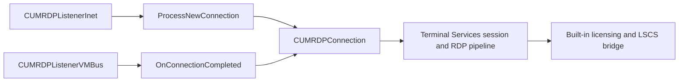

# Windows Sandbox guest RDP server

Windows Sandbox does not use a wholly separate guest RDP server. It uses the normal Terminal
Services protocol-manager architecture with a VM-specific listener transport:

```text
host named pipe -> RDV/VMBus -> guest VMBus listener -> CUMRDPConnection -> Terminal Services
```

The listener's control and data channels are private Windows implementation details. After that
listener creates the connection object, the session follows the shared RDP server pipeline rather
than a Sandbox-only display protocol.

## Evidence scope

The hard-coded listener selection was recovered from the supplied guest `termsrv.dll` artifact.
The detailed protocol-manager, VMBus listener, and pipe control flow was recovered from the locally
installed `rdpcorets.dll` component at a nearby serviced `10.0.26100` revision. Their shared
component names and listener architecture establish the relationship recorded here; the private
identifiers and exact control-message layout are static facts only for the examined
`rdpcorets.dll` version.

## Components and ownership

| Component | Static role |
| --- | --- |
| Guest `termsrv.dll` | Starts the hard-coded VM listeners and hands their internal identifiers to the registered RDP protocol manager |
| Guest `rdpcorets.dll` | Implements `UMRDPProtocolManager`, the VM, HVSock, and ordinary TCP listeners, plus `CUMRDPConnection` |
| Guest `rdpbase.dll` | Provides shared RDP base factories and platform infrastructure used by `rdpcorets.dll` |
| Guest `vmbuspipe.dll` | Generic VMBus-pipe channel and notification implementation dynamically loaded by the VM listener |
| Host `vmicrdv.dll` and `vmrdvcore.dll` | Bridge the host endpoint/RDV side of the connection; they do not implement the guest listener or LSCS policy |

The ordinary `RDP-Tcp` listener remains registry-configured and uses the same
`UMRDPProtocolManager` COM class registered from `rdpcorets.dll`. Its transport configuration,
such as TCP port 3389 and `tdtcp`, is not used to create the VM listener.

## Hard-coded VM listener startup

Static analysis of the guest `termsrv.dll` identified these functions:

| Function | Role |
| --- | --- |
| `CRemoteConnectionManager::StartStopHardcodedListeners` | Starts the VM listeners outside the ordinary `WinStations\RDP-Tcp` registry path |
| `CRemoteConnectionManager::StartVMListener` | Maps listener type `2` to VMBus and type `3` to HVSock, then requests the protocol extension listener |
| `CProtocolExMgr::CreateListener` | Instantiates the registered protocol manager's listener implementation |

`StartStopHardcodedListeners` requests the VMBus listener (type `2`) for a supported VM
configuration. It requests the HVSock listener (type `3`) only when
`HKLM\SYSTEM\CurrentControlSet\Control\Terminal Server\WinStations\StartHvSocketListener` is
nonzero. The VM listener is suppressed when
`HKLM\SOFTWARE\Microsoft\Virtual Machine\Guest\DisableEnhancedSessionConsoleConnection` is
nonzero. The surrounding Terminal Services checks also require the expected Microsoft hypervisor,
VM/OOBE state, and supported built-in license type.

The strings passed from `termsrv.dll` to the protocol manager are private listener identifiers,
not listener names that are created as normal WinStation registry entries. In the examined
`rdpcorets.dll`, `CUMRDPProtocolManager::CreateListener` recognizes the VMBus identifier
`31C5CE94259D4006A9E4` and creates `CUMRDPListenerVMBus`. The neighboring HVSock identifier
`41C5CE94259D4006A9E4` creates `CUMRDPListenerHvSocket`.

These identifiers are version-specific implementation details. They are recorded for component
attribution, not as an external contract or a supported listener-creation mechanism.

## Same protocol manager, different acceptor

`CUMRDPProtocolManager::CreateListener` selects an acceptor based on the internal identifier:

| Listener | Selected implementation | Transport role |
| --- | --- | --- |
| Ordinary `RDP-Tcp` | `CUMRDPListenerInet` | Configurable TCP listener |
| VM type `2` | `CUMRDPListenerVMBus` | VMBus-pipe control and data channels |
| VM type `3` | `CUMRDPListenerHvSocket` | HVSock-based VM listener |

All listener implementations inherit the common listener base. That base initializes an
`IRDPENCTcpStreamPool` through the shared RDP API, even when the accepted stream is not a TCP
socket. This is reusable RDP infrastructure, not evidence that the type-2 listener opens TCP
port 3389.

The convergence point is explicit in the static control flow:



`CUMRDPListenerInet::OnConnectionCompleted` passes its accepted connector endpoint to
`CUMRDPListenerBase::ProcessNewConnection`. That function creates `CLSID_UMRDPConnection` with
`IID_IUMRDPConnection`, initializes it, and retains it in the listener's connection list.

`CUMRDPListenerVMBus::OnConnectionCompleted` creates that same `CLSID_UMRDPConnection`, calls its
same initialization entry point with the VMBus channel handle, and retains it in the same kind of
connection list. The inputs to the common connection object differ; the RDP server implementation
after accept does not.

## VMBus control and data handoff

`CUMRDPListenerVMBus::StartListen` dynamically loads `vmbuspipe.dll` and resolves exactly these
exports:

```text
VmbusPipeClientOpenChannel
VmbusPipeClientRegisterChannelNotification
VmbusPipeClientUnregisterChannelNotification
VmbusPipeClientReadyForChannelNotification
```

It first registers for the private SynthRDP control endpoint:

| Endpoint field | Value in examined `rdpcorets.dll` |
| --- | --- |
| Control class ID | `{F8E65716-3CB3-4A06-9A60-1889C5CCCAB5}` |
| Control instance ID | `{99221FA0-24AD-11E2-BE98-001AA01BBF6E}` |
| Data class ID | `{F9E9C0D3-B511-4A48-8046-D38079A8830C}` |

After the control endpoint is offered, the listener opens its channel and performs a private
version exchange. The examined implementation writes a 16-byte version request, requires a
17-byte response, and accepts only the internal
`SYNTHRDP_TRUE_WITH_VERSION_EXCHANGE` response state.

It then asynchronously reads a 24-byte control message. A message whose first field is the
internal `SynthRdpCreateSession` type (`3`) supplies a per-session GUID at byte offset `8`.
`rdpcorets.dll` registers a notification for the data class ID paired with that GUID. When that
data channel is offered, it opens the channel and calls
`CUMRDPListenerVMBus::OnConnectionCompleted`, creating the shared `CUMRDPConnection`.

The protocol above is private and only describes the narrow handoff recovered from the examined
build. It is not the documented RDP connection sequence and should not be treated as a supported
ABI.

The complete private state machine, size checks, and `vmbuspipe.dll` callback roles are recorded in
[the SynthRDP control handoff](windows-sandbox-synthrdp-control.md).

## What `vmbuspipe.dll` does and does not do

The exact listener dependency is `vmbuspipe.dll`, not the similarly named `vmbuspiper.dll`.
`vmbuspipe.dll` is a generic VMBus-pipe library:

- it enumerates matching device interfaces and their `UserDefined` registry data;
- it opens offered channels through a generated channel path with incoming/outgoing buffer sizes;
- it creates asynchronous channel notifications through Configuration Manager and the thread pool;
- it can also offer or connect generic server channels.

It contains no SynthRDP control parser or RDP protocol implementation. The `SynthRdpCreateSession`
validation and the conversion from VMBus handle to `CUMRDPConnection` occur in
`rdpcorets.dll`.

`vmbuspiper.dll` is a related generic VMBus-pipe component with client/server offer and open APIs,
but it is not the DLL that `CUMRDPListenerVMBus` loads for its notification-based listener in the
examined build.

## RDP and licensing boundary

Once `CUMRDPConnection` has been created, normal RDP connection, capability, channel, session, and
licensing machinery applies. The documented RDP PDU sequence begins above this private transport
handoff; the Microsoft RDP specifications do not define the VMBus control exchange described
above.

The direct Sandbox test selected standard RDP security with `PROTOCOL_RDP` and
`ENCRYPTION_LEVEL_NONE`. That observed RDP setting does not turn the named-pipe/VMBus transport
into a public or unauthenticated interface.

The guest type-2 listener still selects the built-in licensing path before full desktop admission.
Changing the acceptor from ordinary TCP to VMBus changes the transport, not the later
`tssrvlic.dll` and `LSCSHostPolicy.dll` decision path. See
[licensing and desktop admission](windows-sandbox-licensing.md) and
[the RDP protocol boundary](windows-sandbox-rdp-protocol-boundary.md).

## Version scope

The listener-routing evidence comes from the supplied guest `termsrv.dll` artifact in the
`10.0.26100` family. The component-level listener analysis used these locally examined system
files:

| Component | Version |
| --- | --- |
| `rdpcorets.dll` | `10.0.26100.8737` |
| `rdpbase.dll` | `10.0.26100.8875` |
| `vmbuspipe.dll` | `10.0.26100.8521` |
| `vmbuspiper.dll` | `10.0.26100.8521` |

Windows servicing can change these private identifiers, handshakes, and implementation boundaries.
Revalidate them rather than relying on them across component updates.
