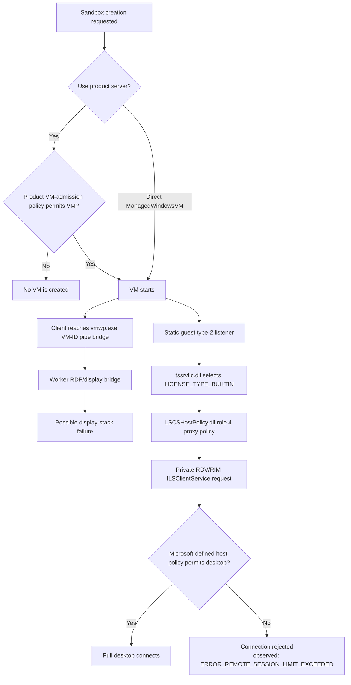

# Windows Sandbox licensing and desktop admission

This note documents the observed Windows Sandbox desktop-admission route. It explains where the
single-desktop behavior is enforced in the tested retail configuration and, equally importantly,
what has **not** been identified as a supported configuration surface.

No part of this note is guidance for evading licensing, policy, session limits, or entitlement
enforcement.

## Observed result

The tested Windows retail configuration supports several direct Sandbox VMs running at once. The
desktop-concurrency result now has three separate evidence classes:

1. An earlier controlled run observed a later concurrent desktop rejected with
   `ERROR_REMOTE_SESSION_LIMIT_EXCEEDED`.
2. A later two-VM run had both sessions first reach `Connected`; the second then disconnected with
   RDP Set Error Info `CloseStackOnDriverFailure` (`0x00000011`) while the first stayed connected.
   That code reports remote display-driver startup failure, not a licensing status.
3. A timestamped same-size baseline again reached `Connected` for both sessions. Thirty-three
   seconds later, the second reported `ERRINFO_LOGOFF_BY_USER` while the first stayed connected.
   That is the server's logoff classification, not proof of a human action or an identified
   admission-policy source.
4. A same-VM control connected two independent clients to one disposable Sandbox endpoint. The
   first was immediately disconnected with `ERRINFO_DISCONNECTED_BY_OTHERCONNECTION` (`0x5`), while
   the second remained connected.

The same-VM control matches the worker RDP Encoder's local replacement behavior: a new attendee
triggers termination of the existing `RemoteConnection` in that encoder instance. This is distinct
from the cross-VM post-connect failures, where each Sandbox has its own worker. Using distinct
per-VM GCC client names ruled out an RDP client-name collision as the cause. The evidence confirms
a host-mediated LSCS admission RPC, but it does not justify attributing any post-connect failure in
these current cross-VM runs to that RPC without a correlated call trace.

The product `WindowsSandboxServer.exe` can additionally reject a second active Sandbox before VM
creation. Direct lifecycle creation skips that **product orchestration** gate, but it does not skip
the guest/host desktop-admission gate described below.

## Decision tree



The first branch is product VM admission. The lower branch is the confirmed guest LSCS admission
route. They are independent enough that bypassing the first through direct lifecycle management
does not establish permission through the second. The diagram is not evidence that the
`CloseStackOnDriverFailure` display-path result is produced by LSCS.

## Guest-side route

The direct Windows Sandbox transport is listener type `2`. `termsrv.dll` chooses
`LICENSE_TYPE_BUILTIN` directly for listener types `2` and `3`.

The type-2 listener is a transport specialization, not a separate licensing implementation:
`CUMRDPListenerVMBus` in `rdpcorets.dll` creates the same `CUMRDPConnection` object used after an
ordinary TCP accept. The private VMBus accept flow is documented in
[the guest RDP server](windows-sandbox-guest-rdp-server.md).

| Item | Verified value or behavior |
| --- | --- |
| Built-in license GUID | `{45344FE7-00E6-4AC6-9F01-D01FD4FFADFB}` |
| Guest licensing DLL | `tssrvlic.dll` |
| Selected role | `4` |
| Role-4 implementation | `CDVMProxyLicenseLibrary` and `CProxyPolicy` |
| Local grace fallback | No ordinary local grace fallback was found on this route |
| Next guest component | `LSCSHostPolicy.dll` |

`CProxyPolicy::Activate` loads the guest `LSCSHostPolicy.dll`, which bridges to a private
host-mediated policy service over RDV/RIM.

### Private LSCS bridge

| Item | Value |
| --- | --- |
| Endpoint name | `RdvVmEndPointLSCS` |
| Endpoint type GUID | `{EC2F6497-8DFD-4810-91B0-A6F3EADA76B2}` |
| Endpoint instance GUID | `{9B2DFDD6-20F1-411C-8AC2-4FAF34A11EB8}` |
| Host interface requested by guest | `IID_ILSClientService` `{B3461E73-AE5B-465B-8BDB-42BC5E87F22C}` |
| Dynamic RIM object ID | `1` |

The guest-side interface request confirms that the final decision comes from host policy. It does
not expose a customer-selectable license type or a normal RDP configuration option.

### Guest client adapter, not a host implementation

Symbols recovered from `LSCSHostPolicy.dll` version `10.0.26100.7623` make the direction of this
bridge explicit:

```text
CHostPolicy::HostProcessData
  -> CHostPolicy::GetRimLSCSInstance
  -> CHostPolicy::ConnectToHostAndIntegrateWithRim
  -> CChannelMgr::Connect
  -> CVmBusNamedPipeChannel::ConnectToParentPartition
  -> CRIMObjManager::GetProxy(IID_ILSClientService, 1)
```

`CHostPolicy::HostProcessData` forwards the licensing request through the returned
`ILSClientService` proxy. The same library contains generic RIM proxy/stub and VMBus-pipe
channel-manager code, including an `Offer` method, but the examined `CHostPolicy` path calls
`Connect` and `ConnectToParentPartition`; it does not construct the concrete
`ILSClientService` implementation.

This is direct static evidence that `LSCSHostPolicy.dll` is the **guest-side client adapter** for
the private request. It confirms the guest-to-host direction without identifying which host
component supplies the remote RIM object.

### The authenticated-user admission call

The role-4 `CProxyPolicy` selected by guest `tssrvlic.dll` activates
`LSCSHostPolicy.dll` through `CreateInstanceOfHostPolicy`. After an RDP user authenticates, the
call chain is:

```text
CProxyPolicy::UserAuthenticated
  -> IHostPolicy::HostUserAuthenticated
  -> CHostPolicy::HostUserAuthenticated
  -> ILSClientService::LSCSUserAuthenticated
```

`CHostPolicy::HostUserAuthenticated` obtains RIM object ID `1`, invokes its
`ILSClientService` proxy, and returns the remote HRESULT to the guest policy. The matching
`CStubILSClientService::Invoke_LSCSUserAuthenticated` deserializes the protocol-context handle and
the two authenticated-user strings before calling the concrete host object. This identifies the
host RPC that makes the admission decision; it does not identify the object implementation behind
the RIM stub.

### Worker-hosted pipe and display bridge

An elevated handle capture proved that `\\.\pipe\{VM-ID}` is owned by the target Sandbox
`vmwp.exe` worker. A before/after worker-module capture then found the connection-time RDP/display
stack:

```text
vmuidevices.dll
  -> rdp4vs.dll
  -> RDPBASE.dll
  -> RDPSERVERBASE.dll
```

`vmuidevices!RdpEncoder` contains a named-pipe listener and passes connected pipes to
`IRDP4VSNamedPipe` after loading `rdp4vs.dll`. This is a worker-hosted RDP bridge. It has no LSCS
identifier, and the elevated worker module list contained neither `LSCSHostPolicy.dll`,
`vmicrdv.dll`, `vmrdvcore.dll`, nor `rdvvmtransport.dll`.

`rdp4vs!RDPAPI_CreateInstance` first calls `RDPSERVERBASE_CreateInstance`, falling back to
`RDPBASE_CreateInstance` only if that fails. Its attendee-connected callback reaches
`RdpEncoder::OnClientConnected`, which creates a policy engine and checks the caller's
VM-view/input ACL before accepting the connection; the attendee-ready callback reaches
`RdpEncoder::OnClientReady`. This confirms an independent worker RDP lifecycle and ACL boundary.

`RDPSERVERBASE.dll` contains the regular RDP encoder licensing plugin and protected OS licensing
client. Its `CRDPWDUMXStack::SetErrorInfo` emits the standard Server Set Error Info PDU before
disconnecting, and `IsLicenseRequiredByOS` returns false on non-server Windows before considering
server/RDS licensing conditions. The standard wire-licensing implementation is therefore not
sufficient evidence for the Windows-client LSCS decision or for the exact source of a particular
post-connect error code.

## Host-side findings

`Msvm_RdvComponent` loads `vmicrdv.dll`, which uses `vmrdvcore.dll` and the generic RDV endpoint
transport. Its `ICRdvVdevDevice::LoadRdvVmTransportDll` creates the transport's role-3 instance
and registers the generic `RdvVmEndPointTransport` endpoint. Its
`RdvVDevServerRpc::CreateVmEndPoint` accepts an endpoint name and GUID from its caller, then
forwards the constructed properties to the transport.

`vmrdvcore.dll` makes the separation explicit:

```text
CRdvVmbusTransport::CreateVmEndPoint(
    tagRDV_VMENDPOINT_PROPERTIES *,
    IRdvVmEndPointSink *,
    IRdvVmEndPoint **)
```

The sink is optional. `vmicrdv.dll` passes null, causing
`CRdvVmChannelEndPoint::RegisterSink` to install two internal relay sinks instead. Their
`OnDataReceived` implementation writes each payload to the opposite VMBus-pipe or named-pipe half.
This makes the RDV VDEV a generic VMBus-to-named-pipe conduit for the default path.

The shared transport code in both `vmrdvcore.dll` and `rdvvmtransport.dll` contains the LSCS
endpoint instance and type GUIDs. `CRdvVmbusChannel::OfferChannel` compares an endpoint's instance
with `{9B2DFDD6-20F1-411C-8AC2-4FAF34A11EB8}` and selects
`{EC2F6497-8DFD-4810-91B0-A6F3EADA76B2}` instead of the generic transport type before calling
`VmbusPipeServerOfferChannel`. This proves that the generic transport can offer the LSCS channel
when a caller supplies the LSCS instance.

It does not identify the caller that supplies that instance or the RIM implementation that handles
object ID `1`. Its built-in role-1 initialization creates `RdvVmEndPointTransport` and unrelated
task-manager, configuration, session-monitor, Unified API, and allow-list endpoints; it does not
create LSCS. Endpoint creation through the RDV VDEV remains a private RPC that can accept
caller-supplied properties and returns a fresh random token for its named-pipe half. Therefore,
neither the endpoint name nor the transport selector attributes the final policy receiver.

### Runtime-host exclusion test

A controlled direct VM and IronRDP connection reproduced a successful LSCS-backed desktop while
both host `TermService` and `vmicrdv` services remained stopped. This excludes the host Session
Environment/Terminal Services service path and the `icsvcext.dll` RDV integration service as the
active receiver in this direct flow. Medium-integrity inspection of the newly created protected
`vmwp.exe` worker could not enumerate its modules, and `tasklist /m` did not attribute any of the
candidate RDV modules.

The remaining host boundary is consequently a runtime-registered worker/Hyper-V handler or another
private component unavailable to medium-integrity module inspection. It services the marshaled
`IID_ILSClientService` request without a separately attributable static policy binary.

### Dynamic VDEV loading

`vmwp.exe` explains why static searches do not identify every VDEV-backed receiver. It builds a
VDEV manifest from the VM repository and `VirtualMotherboard::CreateVirtualDeviceInstance` invokes
`CoCreateInstance(device CLSID, IID_IVirtualDevice)`. The worker consequently loads a selected
VDEV through registration and manifest state; it does not need to contain the VDEV name, DLL name,
or its endpoint identifiers in its own image.

This proves a static-image absence cannot exclude a dynamically selected provider. It does not,
however, make every licensing-adjacent VDEV an LSCS receiver.

The worker's `ReadVDevClassInfo` loads the conventional VDEV class/interface catalog from:

```text
HKLM\SOFTWARE\Microsoft\Windows NT\CurrentVersion\Virtualization\VirtualDevices
```

A complete read-only search of that catalog found none of the LSCS interface, endpoint-instance, or
endpoint-type identifiers. This rules out discovering the receiver through a conventionally
registered VDEV interface. It does not exclude a dynamically provisioned worker handler or a
manifest-selected provider that does not advertise LSCS in its registration.

A bounded direct-Sandbox probe also showed that its returned VM ID is not exposed as an
`Msvm_ComputerSystem` in the ordinary `root\virtualization\v2` WMI namespace. Consequently, the
standard WMI setting associations cannot be used to retrieve that VM's VDEV manifest; the
VM-specific repository and protected worker remain the necessary attribution boundary.

Public symbols for `vmcompute.exe` further disambiguate the similarly named HCS resource:
`ModifyLicensingSettings` parses `Schema::VirtualMachines::Resources::Licensing`, creates a
`VmHandleBroker` for `ACTIVATION_INSTANCE_ID`, then invokes
`IVmVirtualDeviceAccess`. `VDevManifestVm::PopulateFromSchemaSettings` adds
`ACTIVATION_DEVICE_ID` with that same instance when the resource is enabled. Thus
`VirtualMachine/Devices/Licensing` configures `ActivationVDev.dll`; it is not the LSCS RIM
receiver or a session-admission setting.

`vmbusvdev.dll` is an even lower generic layer. Its `VmbusVdev::Initialize` opens the worker's
`\\.\VMBus\vdev\{...}` device and `GetVmbusPipeTransport` returns an `IVMBusTransport` object to
other VDEVs. It has no LSCS/RIM endpoint or licensing-provider code. It supplies transport
plumbing, not the application peer selected over that plumbing.

### Activation VDEV is a separate licensing path

`VirtualMachine/Devices/Licensing` selects the registered `CSppActivationVDev` class
`{BC12C717-8898-4688-8EE4-2CD14894F8EA}`, implemented by `ActivationVDev.dll`; the examined
instance is `{4487B255-B88C-403F-BB51-D1F69CF17F87}`. The component is dynamically loaded through
the manifest mechanism above.

The examined `ActivationVDev.dll` identifies itself through its private source path as an SPP
activation virtual device. It imports Client Licensing Platform APIs and contains
`Microsoft.ClientLicensing.InheritedActivation`, `InheritedActivationRequest`, and
`InheritedAppLicensingRequest`. It also hosts a direct VMBus-pipe server using the fixed GUID pair:

| Activation VDEV identifier | Value |
| --- | --- |
| VDEV instance | `{4487B255-B88C-403F-BB51-D1F69CF17F87}` |
| Offered VMBus-pipe service | `{3375BAF4-9E15-4B30-B765-67ACB10D607B}` |

Neither identifier matches the LSCS RDV endpoint type or instance, and the binary contains no
LSCS/RDV marker or `IID_ILSClientService` reference. This is strong negative evidence that
`ActivationVDev.dll` is not the *direct* LSCS endpoint sink. It remains a parallel VM
activation/licensing channel, not a demonstrated owner of the desktop-admission decision.

The host peer for this *separate* activation path is now identified. `sppsvc.exe` exports
`SLSProcessVMPipeMessage`; its handler receives a 16-byte `SppIABindingVmId` and a
`SppBindingActivationRequest`, invokes the internal notification
`msft:spp/notifications/common/processvmpipemessage`, and returns
`SppBindingActivationResponse`. `ActivationVDev.dll` contains the matching
`SLpProcessVMPipeMessage` and `InheritedActivationRequest` names. This is direct evidence for
Software Protection Platform handling inherited activation through the Activation VDEV.

It is not the LSCS desktop-admission receiver. During a controlled direct Sandbox desktop
connection, 174 service-state samples observed `sppsvc` and `ClipSVC` stopped while
`LicenseManager` remained running; no `sppsvc.exe` process appeared. Thus the activation service
was not activated in the tested LSCS request path.

`vmcompute.exe` recognizes an internal VM resource:

```text
VirtualMachine/Devices/Licensing
```

The resource includes strings such as `EnableLicensing` and `enabled`. The compute service
serializes that resource and forwards it to the worker over a generic virtual-device-access call.
It is not exposed as:

- a Hyper-V WMI licensing class or property;
- a virtualization registry setting;
- an ordinary Terminal Services session-count setting; or
- an IronRDP configuration property.

The static images examined for the LSCS endpoint and `IID_ILSClientService` did not contain those
markers: `vmcompute.exe`, `VmComputeAgent.exe`, `vmcompute.dll`, `vmwp.exe`, `vmicrdv.dll`,
`vmbuspipe.dll`, `vmbuspiper.dll`, `vmprox.dll`, `vmuidevices.dll`, and `rdp4vs.dll`.
`vmrdvcore.dll` and `rdvvmtransport.dll` are the narrow exception: each contains the LSCS type and
instance selector in generic offer-channel code, but neither contains `IID_ILSClientService` or
concrete desktop-admission policy logic.

Public symbols for `vmbuspipe.dll` and `vmbusproxy.sys` show only generic client/server channel
enumeration, offer, open, close, and GPADL operations. Neither has an LSCS, RIM, RDV, or licensing
policy routine. During successful direct connections, `ManagedWindowsVM.exe` and the per-VM
`cmproxyd.exe` loaded no new modules; temporal pipe sampling found no private LSCS pipe; and the
only repeatable new `svchost.exe` instance was `FrameServerMonitor`, the Windows Camera Frame Server
Monitor. These observations rule out a separately launched or dynamically loaded user-mode helper
on this tested path.

The strongest current conclusion is that the final policy receiver is provisioned dynamically
as a pre-registered object inside protected `vmwp.exe` worker/runtime state, or another
equally privileged Hyper-V runtime boundary. This is an inference from the exclusions above, not
an attribution to a specific binary. An elevated post-connect module/image-load capture or
call-stack capture at `ILSClientService::LSCSUserAuthenticated` is still required to identify the
concrete sink.

## Observed display-path concurrency case

One direct two-VM test held the first desktop connected, started the second, and checked both states
after thirty seconds. The first remained connected; the second reported:

```text
CloseStackOnDriverFailure (0x00000011)
```

This is a server RDP error indicating display-driver startup failure. Compute event logs show that
both VMs were configured with GPU assignment mode `Mirror` and vendor extensions enabled. The failed
worker loaded `gpupvdev.dll` and `VrdUmed.dll` alongside the worker RDP bridge.

This is a strong lead for practical multi-desktop reliability, but not proof that GPU assignment is
the root cause and not proof of an LSCS entitlement outcome. It must remain separate from the
confirmed `ILSClientService::LSCSUserAuthenticated` boundary.

Later same-size sampling again observed both sessions reach `Connected`; the second instead reported
`ERRINFO_LOGOFF_BY_USER` after 33 seconds while the first stayed connected. A lower-resolution
second-desktop comparison observed the display-driver error on the first session and the logoff
code on the second. The current evidence therefore does not assign either post-connect outcome to a
fixed VM position or to LSCS.

## Controls that do not select this policy

The investigation ruled out the usual client-SKU RDP controls as the source of the observed
cross-VM outcomes:

- `MaxSessions`;
- `AllowMultipleSessions`;
- normal Terminal Server registry settings; and
- per-VM client-name selection.

`CConnectionEx::GetLicenseType` can consume a generic
`PROPERTY_TYPE_LICENSE_GUID`, but that is not the direct Sandbox selector: the type-2 listener
path selects `LICENSE_TYPE_BUILTIN` before that generic property is relevant.

The Hyper-V Enhanced Mode setting and its token ACL checks are also separate. They are documented
in [Enhanced Mode virtual devices](windows-sandbox-enhanced-mode.md).

## What may be allowed

Only the following is established on the tested retail build:

| Scenario | Observed outcome |
| --- | --- |
| Several direct Sandbox VM instances running | Allowed |
| First direct Sandbox full desktop | Allowed |
| Historical later concurrent desktop | Rejected with `ERROR_REMOTE_SESSION_LIMIT_EXCEEDED` |
| Current two-VM concurrent desktop | Both sessions initially connect; later observations include `CloseStackOnDriverFailure` and `ERRINFO_LOGOFF_BY_USER` |
| Two clients to one Sandbox VM | First session is replaced with `ERRINFO_DISCONNECTED_BY_OTHERCONNECTION`; second remains connected |
| Product-server VM creation beyond its own admission decision | May be rejected before VM creation |

Different Windows editions, servicing levels, enterprise entitlements, or Microsoft-hosted
environments can carry different Microsoft-defined policy. This investigation found no evidence of
a supported, customer-configurable setting that changes the Sandbox LSCS decision. Any claim about
another SKU or environment requires separate, compliant testing and its own evidence.

## Remaining attribution work

The elevated worker capture completed. It proved that the VM-ID pipe is owned by `vmwp.exe` and
identified the worker RDP/display bridge, but found no `LSCSHostPolicy.dll`, `vmicrdv.dll`,
`vmrdvcore.dll`, or `rdvvmtransport.dll` in that worker. The next discriminating evidence is a
read-only call stack or object-registration capture at
`ILSClientService::LSCSUserAuthenticated`, correlated with both the historical license-limit result
and the current display-driver failure.

Until that capture exists, the final policy implementation should be described as **host-mediated
and dynamically unattributed**, not assigned to a guessed executable or DLL.

The evidence needed to narrow that attribution, without altering Windows policy or entitlement
state, is tracked in [open questions and evidence plan](windows-sandbox-open-questions.md).
