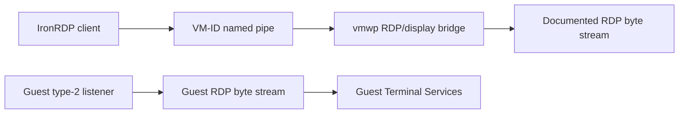

# Windows Sandbox RDP protocol boundary

This note distinguishes the documented RDP protocol that IronRDP implements from the
Windows-private worker and guest paths that handle Sandbox bytes.

## Boundary map

The worker-pipe and guest-listener edges are Windows implementation details. Static guest analysis
shows that `CUMRDPListenerVMBus` creates `CUMRDPConnection`; elevated runtime capture shows that
the VM-ID pipe is owned by the worker RDP/display bridge. The exact object-level handoff between
those two private paths remains unresolved.

## Documented protocol sequence

The following sequence is the applicable public protocol layer after Windows provides the RDP
stream. It is not a description of the VMBus control channel.

| Stage | Public specification | Relevance to Sandbox |
| --- | --- | --- |
| RDP connection sequence | [MS-RDPBCGR] section 1.3.1.1, "Connection Sequence" | Applies after Windows hands the RDP byte stream to its private Sandbox endpoint |
| X.224 connection request and RDP negotiation request | [MS-RDPBCGR] section 2.2.1.1 | Sent by the client on the established Sandbox RDP stream |
| X.224 connection confirm and negotiation response | [MS-RDPBCGR] section 2.2.1.2 | Selects the RDP security protocol; the direct test observed `PROTOCOL_RDP` |
| MCS/GCC client and server connect PDUs | [MS-RDPBCGR] sections 2.2.1.3 and 2.2.1.4 | Carry core, security, network, monitor, and channel information |
| MCS attach and channel joins | [MS-RDPBCGR] sections 2.2.1.5 through 2.2.1.9 | Establish the user and shared channels |
| Capability exchange | [MS-RDPBCGR] section 2.2.1.13 | Negotiates graphics, input, virtual-channel, and other RDP capabilities |
| Virtual-channel PDUs | [MS-RDPBCGR] section 2.2.6 | Applies to channels such as clipboard after capability/channel setup |
| Licensing PDUs | [MS-RDPELE] sections 1.3.3 and 3.3.5.3 | Defines client/server licensing PDU flows, separate from the local LSCS host-policy decision |

`[MS-RDSOD]` section 1.1, "Conceptual Overview", provides the broader RDS model: an RDP client
interacts with a remote session through the RDP protocol. That model continues to apply to the
Sandbox guest once the private listener has admitted a connection.

## What the specifications do not define

No examined Microsoft Open Specification defines:

- the host `\\.\pipe\{VM-ID}` endpoint;
- RDV endpoint creation for a Sandbox VM;
- the SynthRDP control class, fixed instance, or data-channel GUID exchange;
- the `vmbuspipe.dll` notification API contract; or
- the private LSCS `ILSClientService` request that controls Sandbox desktop admission.

Those are Windows product internals below, beside, or after the documented RDP PDU processing
layer. The static implementation record is in
[the SynthRDP control handoff](windows-sandbox-synthrdp-control.md).

## Security and licensing interpretation

The tested direct connection selected `PROTOCOL_RDP` and `ENCRYPTION_LEVEL_NONE`. That result
describes the negotiated RDP security mode for that session. It does not characterize the security
properties of the private host named-pipe, RDV, or VMBus transport, and it does not grant a client
control over Windows Sandbox licensing.

The standard RDP licensing extension and the Sandbox local licensing route also have different
responsibilities:

| Mechanism | Scope |
| --- | --- |
| [MS-RDPELE] licensing PDUs | Client/server protocol messages and client licensing state |
| Guest `tssrvlic.dll` role 4 | Selects the Sandbox built-in/DVM proxy route |
| Guest `LSCSHostPolicy.dll` | Requests private host policy through RDV/RIM |
| Guest/host `lsm.dll` container RPC | Counts interactive container sessions over a private HVSock service |
| Host LSCS policy receiver | Separate private licensing decision; implementation remains dynamically unattributed |

The host LSM path explains the historical `ERROR_REMOTE_SESSION_LIMIT_EXCEEDED` and the repeatable
post-connect `ERRINFO_LOGOFF_BY_USER` (`0x0C`). `CloseStackOnDriverFailure` (`0x11`) can occur when
the denied session tears down during IDD startup. [MS-RDPBCGR] section 2.2.5.1 defines both wire
values as server Set Error Info values sent before a server disconnect. A client must surface each
Windows outcome without treating it as an RDP framing issue or retryable transport error.

## Implications for IronRDP

The supported integration boundary is narrow:

1. Ask Windows to create or locate a Sandbox VM through the supported product route or the existing
   experimental lifecycle wrapper.
2. Use the Windows-provided named-pipe transport as an ordered RDP byte stream.
3. Run IronRDP's ordinary negotiation, GCC/MCS, capability, channel, graphics, input, and
   disconnection handling.
4. Surface Windows admission errors without presenting a workaround or implying that a client
   option changes entitlement.

IronRDP does not need to emulate `CUMRDPListenerVMBus`, `vmbuspipe.dll`, RDV, or the guest
licensing provider to implement the documented RDP client side.

## Sources consulted

| Protocol | Sections used |
| --- | --- |
| [MS-RDPBCGR]: Remote Desktop Protocol: Basic Connectivity and Graphics Remoting | 1.3.1.1 "Connection Sequence"; 2.2.1.1 "Client X.224 Connection Request PDU"; 2.2.1.3 through 2.2.1.13 "Connection Sequence"; 2.2.5.1 "Server Set Error Info PDU"; 2.2.6 "Static Virtual Channels" |
| [MS-RDPELE]: Remote Desktop Protocol: Licensing Extension | 1.3.3 "Licensing PDU Flows"; 1.4 "Relationship to Other Protocols"; 3.3.5.3 "Sending Client License Information" |
| [MS-RDSOD]: Remote Desktop Services Protocols Overview | 1.1 "Conceptual Overview"; 2.1 "Overview"; 2.2.1 "Protocol Relationship Diagram" |

The protocol specifications establish the public RDP layer. The Windows-private transport findings
are static or observed evidence from the component versions listed in
[the evidence matrix](windows-sandbox-evidence.md).
