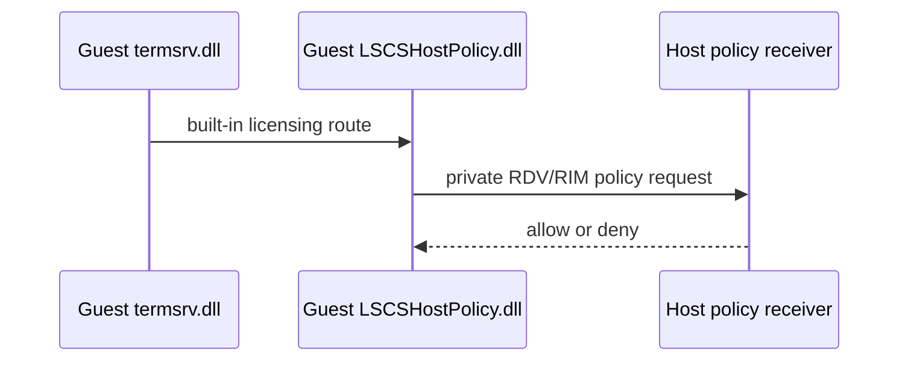

# Windows Sandbox RDP and RDV transport

This note separates the direct Sandbox RDP path from the Hyper-V Enhanced Mode path. Both are
RDP-related, but they are implemented by different components and have different authorization
boundaries.

## Direct Sandbox pipe path

The Windows Sandbox endpoint used by IronRDP is a host named pipe:

```text
IronRDP client -> \\.\pipe\{VM-ID} -> vmwp.exe worker RDP bridge
```

An elevated handle capture proved that the named pipe is owned by the Sandbox VM's protected
`vmwp.exe` worker, not by `vmcompute.exe`, `vmms.exe`, or an external service. The pipe is therefore
a worker-hosted presentation point, not evidence that a client has opened a guest kernel object
directly.

The worker loads `vmuidevices.dll`, `rdp4vs.dll`, `RDPBASE.dll`, and `RDPSERVERBASE.dll` after a
desktop connection. `vmuidevices.dll` contains both `SynthRdpDevice` and `RdpEncoder`
named-pipe listeners. Its `RdpEncoder::OnNamedPipeConnectionEstablished` passes a connected pipe
to `IRDP4VSNamedPipe` in `rdp4vs.dll`, which supplies the worker-hosted RDP/display bridge.

The guest still statically contains the type-2 `termsrv.dll` listener and its LSCS licensing route.
The exact runtime handoff from the worker's VM-ID pipe listener to that guest path is private and
not yet attributed at the individual listener-object level. Consequently, the pipe alone must not
be described as a direct guest VMBus connection.

The RDP4VS named-pipe contract has two recovered private operations. The encoder's direct accept
path invokes `CreateRDPConnection`, which starts the internal RDP connector endpoint from an
accepted pipe. SynthRDP instead calls the encoder's `CreateRDPStream` path; this uses the other
named-pipe operation to produce an `IRDPENCNetStream` for the SynthRDP data channel. This makes the
RDP Encoder listener the leading static candidate for the external VM-ID endpoint and SynthRDP the
leading candidate for its worker-to-guest bridge, but an accepted-pipe stack remains necessary to
prove that assignment.

The guest `termsrv.dll` starts a hard-coded type-2 listener, and the registered
`UMRDPProtocolManager` in `rdpcorets.dll` maps it to `CUMRDPListenerVMBus`. That acceptor has a
private VMBus control/data handshake but creates the same `CUMRDPConnection` used by the ordinary
TCP listener. See [the guest RDP server](windows-sandbox-guest-rdp-server.md) for the recovered
listener flow, `vmbuspipe.dll` boundary, and version scope.

The public RDP sequence starts only after this private listener handoff. See
[the RDP protocol boundary](windows-sandbox-rdp-protocol-boundary.md) for the applicable
MS-RDPBCGR and MS-RDPELE sections and the protocol layers Windows does not document.

## Official server connection data

`WindowsSandboxServer.exe` exposes a per-user Sandbox gRPC service. IronRDP's supported product
integration uses it to create/list/stop Sandboxes and obtain the configuration needed to connect to
a product-created VM. This is an orchestration protocol separate from the RDP byte stream.

The direct path can use a known pipe and provisioned credentials, but it does not reproduce the
full product server behavior.

## Guest RDV/LSCS bridge

When a guest connection reaches the built-in licensing route, it crosses a Remote Desktop
Virtualization (RDV) bridge:



This sequence is the statically established guest licensing route if a connection reaches the
type-2 listener. The private handoff from the worker's VM-ID pipe bridge to that listener is not
shown because it remains unresolved.

The RDV VDEV is registered as `Msvm_RdvComponent`. Its virtual-device class ID is:

```text
{6C5ADDB9-A11A-4E8E-84CB-E6208201DB63}
```

`vmicrdv.dll` is the registered VDEV. It uses `vmrdvcore.dll`, which provides generic endpoint
creation and VMBus channel transport. The transport receives endpoint properties and an endpoint
sink from its caller, then routes payloads to that sink. Static analysis did not reveal concrete
LSCS policy code in either generic transport DLL.

## Private LSCS endpoint

The guest-side LSCS bridge requests the following private endpoint information:

| Item | Value |
| --- | --- |
| Endpoint name | `RdvVmEndPointLSCS` |
| Endpoint type | `{EC2F6497-8DFD-4810-91B0-A6F3EADA76B2}` |
| Endpoint instance | `{9B2DFDD6-20F1-411C-8AC2-4FAF34A11EB8}` |
| Requested interface | `IID_ILSClientService` `{B3461E73-AE5B-465B-8BDB-42BC5E87F22C}` |
| Dynamic RIM object ID | `1` |

The endpoint request is evidence of a host-mediated decision, not evidence that the generic RDV
transport implements that decision. The final host receiver remains dynamically attributed rather
than identified as a separate static System32 policy binary.

## Worker RDP and graphics stack

`vmuidevices.dll` hosts the Hyper-V Synthetic RDP and RDP Encoder VDEVs. It can use VMBus-pipe or
Hyper-V socket control channels, plus local named-pipe handoff to `rdp4vs.dll`. That stack:

- checks an Enhanced Mode setting;
- checks the connecting caller's VM access token against an ACL;
- creates RDP4VS graphics/input connections; and
- applies graphics/remoting-object ACLs when configured; and
- creates an `RDPSERVERBASE.dll` instance first through `RDPAPI_CreateInstance`, with `RDPBASE.dll`
  as its fallback RDP implementation.

On an attendee connection, `RDP4VS` calls `RdpEncoder::OnClientConnected`, which constructs a
`RemoteConnection` and checks the caller's VM-view/input ACL before accepting it. Its later
`OnAttendeeReady` callback reaches `RdpEncoder::OnClientReady`, which changes the connection's
control state. This is a distinct worker authorization/lifecycle path, not the guest
`LSCSHostPolicy.dll` route.

`RDPSERVERBASE!CRDPWDUMXStack::SetErrorInfo` writes the standard Server Set Error Info PDU before
disconnecting. It proves the worker RDP server has the protocol machinery used to report
`CloseStackOnDriverFailure`; the exact component that supplied that code in an individual
connection is still not attributed. The worker stack does not contain the LSCS endpoint,
`IID_ILSClientService`, or LSCS licensing code. Its `CRDPWDUMXStack::IsLicenseRequiredByOS`
returns false on non-server Windows, so standard RDP wire licensing in this component is not the
Windows-client LSCS admission decision. See
[Enhanced Mode virtual devices](windows-sandbox-enhanced-mode.md).

### Concurrent desktop result

Concurrent direct-desktop tests do not produce one uniform outcome. Cross-VM comparisons first
reached `Connected` for both VMs:

| Comparison | Post-connect result |
| --- | --- |
| Initial same-size cross-VM run | The second session sent `CloseStackOnDriverFailure` (`0x00000011`); the first remained connected |
| Second desktop at `800x600` | The first later sent `CloseStackOnDriverFailure`; the second later reported `ERRINFO_LOGOFF_BY_USER` |
| Sampled same-size cross-VM baseline | The second reported `ERRINFO_LOGOFF_BY_USER` 33 seconds after both sessions were connected; the first remained connected |
| Same-VM two-client control | The first disconnected with `ERRINFO_DISCONNECTED_BY_OTHERCONNECTION` as soon as the second connected; the second remained connected |

The same-VM result is the local connection-replacement mechanism: `RdpEncoder::OnClientConnected`
terminates the existing `RemoteConnection` in that encoder instance before accepting the new one.
Its `RemoteConnection::Terminate` path invokes RDP4VS's connection-termination operation with the
server's standard `ERRINFO_DISCONNECTED_BY_OTHERCONNECTION` (`0x5`) semantics. This control
establishes a worker-local gate for two clients into one Sandbox endpoint.

It does not establish a cross-VM rule: each Sandbox has its own worker and RDP encoder, and the
cross-VM repros above instead failed after both sessions had connected. Their
`CloseStackOnDriverFailure` and `ERRINFO_LOGOFF_BY_USER` outcomes remain unattributed to the
worker-local replacement path.

Cross-VM runs have used both the shared default guest username (`WDAGUtilityAccount` on every VM)
and distinct custom guest usernames (`IrdpVm1` / `IrdpVm2` / `IrdpVm3`). Those account choices did
not change the multi-mode post-connect failure pattern. Guest accounts are local to each VM; see
[Direct VM lifecycle](windows-sandbox-direct-lifecycle.md#guest-account-identity).

`ERRINFO_LOGOFF_BY_USER` is the server's classification of a session logoff, not evidence of a
human action or an identified policy caller. [MS-RDPBCGR] section 2.2.5.1 defines both it and
`CloseStackOnDriverFailure` as server Set Error Info values sent before a server disconnect.

Both VM configurations set:

```json
{
  "ResourcePath": "VirtualMachine/ComputeTopology/Gpu",
  "Settings": {
    "AssignmentMode": "Mirror",
    "AllowVendorExtension": true
  }
}
```

The failed worker also loaded `gpupvdev.dll` and `VrdUmed.dll`. `VrdUmed` is the Virtual Render
Device user-mode emulation driver, while `gpupvdev` is the Hyper-V GPU-partition VDEV. Those facts
make the GPU/display path a credible explanation for the `0x11` outcome. They do not prove that
GPU mirroring is its root cause, explain the later logoff outcome, or replace the independently
confirmed guest LSCS RPC.

## What transport attribution does not establish

The private transport is not documented by Microsoft Open Specifications as a supported external
protocol. These observations therefore do not establish:

- a stable public protocol contract for the named-pipe or RDV channel;
- that a pipe path selects a different licensing policy;
- that a caller can supply a customer-configurable licensing identity; or
- that a display-stack failure is an LSCS entitlement denial.

The verified decision route and its known limits are documented in
[licensing and desktop admission](windows-sandbox-licensing.md).
