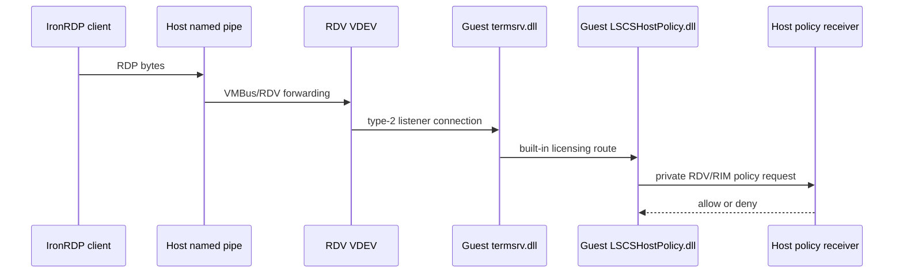

# Windows Sandbox RDP and RDV transport

This note separates the direct Sandbox RDP path from the Hyper-V Enhanced Mode path. Both are
RDP-related, but they are implemented by different components and have different authorization
boundaries.

## Direct Sandbox path

The Windows Sandbox endpoint used by IronRDP is a local named-pipe presentation of the guest's
type-2 VMBus RDP listener:

```text
IronRDP client -> \\.\pipe\{VM-ID} -> VMBus/RDV -> guest termsrv.dll
```

The exact pipe is local to the host. The agent uses normal RDP protocol processing over this
transport; the tested direct Sandbox configuration used standard RDP security with `PROTOCOL_RDP`
and `ENCRYPTION_LEVEL_NONE`.

The named pipe identifies a transport endpoint, not an independent RDP server implementation. Once
the guest connection reaches Terminal Services, guest licensing and host policy participate in
desktop admission.

The guest `termsrv.dll` starts a hard-coded type-2 listener, and the registered
`UMRDPProtocolManager` in `rdpcorets.dll` maps it to `CUMRDPListenerVMBus`. That acceptor has a
private VMBus control/data handshake but creates the same `CUMRDPConnection` used by the ordinary
TCP listener. See [the guest RDP server](windows-sandbox-guest-rdp-server.md) for the recovered
listener flow, `vmbuspipe.dll` boundary, and version scope.

The public RDP sequence starts only after this private listener handoff. See
[the RDP protocol boundary](windows-sandbox-rdp-protocol-boundary.md) for the applicable
MS-RDPBCGR and MS-RDPELE sections and the protocol layers Windows does not document.

## Official server connection data

`WindowsSandboxServer.exe` exposes a per-user Sandbox gRPC service. IronRDP's supported product
integration uses it to create/list/stop Sandboxes and obtain the configuration needed to connect to
a product-created VM. This is an orchestration protocol separate from the RDP byte stream.

The direct path can use a known pipe and provisioned credentials, but it does not reproduce the
full product server behavior.

## RDV bridge

The direct transport crosses a Remote Desktop Virtualization (RDV) bridge:



The RDV VDEV is registered as `Msvm_RdvComponent`. Its virtual-device class ID is:

```text
{6C5ADDB9-A11A-4E8E-84CB-E6208201DB63}
```

`vmicrdv.dll` is the registered VDEV. It uses `vmrdvcore.dll`, which provides generic endpoint
creation and VMBus channel transport. The transport receives endpoint properties and an endpoint
sink from its caller, then routes payloads to that sink. Static analysis did not reveal concrete
LSCS policy code in either generic transport DLL.

## Private LSCS endpoint

The guest-side LSCS bridge requests the following private endpoint information:

| Item | Value |
| --- | --- |
| Endpoint name | `RdvVmEndPointLSCS` |
| Endpoint type | `{EC2F6497-8DFD-4810-91B0-A6F3EADA76B2}` |
| Endpoint instance | `{9B2DFDD6-20F1-411C-8AC2-4FAF34A11EB8}` |
| Requested interface | `IID_ILSClientService` `{B3461E73-AE5B-465B-8BDB-42BC5E87F22C}` |
| Dynamic RIM object ID | `1` |

The endpoint request is evidence of a host-mediated decision, not evidence that the generic RDV
transport implements that decision. The final host receiver remains dynamically attributed rather
than identified as a separate static System32 policy binary.

## Related but separate: Enhanced Mode

`vmuidevices.dll` hosts the Hyper-V Synthetic RDP and RDP Encoder VDEVs. It can use VMBus-pipe or
Hyper-V socket control channels, plus local named-pipe handoff to `rdp4vs.dll`. That stack:

- checks an Enhanced Mode setting;
- checks the connecting caller's VM access token against an ACL;
- creates RDP4VS graphics/input connections; and
- applies graphics/remoting-object ACLs when configured.

It does not contain the LSCS endpoint, `IID_ILSClientService`, or LSCS licensing code. See
[Enhanced Mode virtual devices](windows-sandbox-enhanced-mode.md).

## What transport attribution does not establish

The private transport is not documented by Microsoft Open Specifications as a supported external
protocol. These observations therefore do not establish:

- a stable public protocol contract for the named-pipe or RDV channel;
- that a pipe path selects a different licensing policy;
- that a caller can supply a customer-configurable licensing identity; or
- that Enhanced Mode configuration affects the direct Sandbox desktop license decision.

The verified decision route and its known limits are documented in
[licensing and desktop admission](windows-sandbox-licensing.md).
