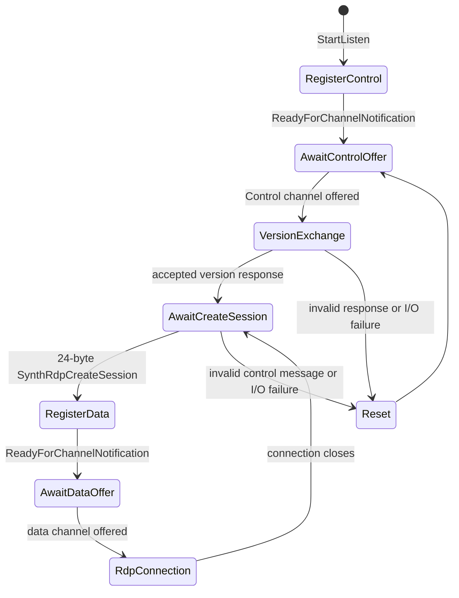

# Windows Sandbox SynthRDP control handoff

This note records the private VMBus handoff implemented by the guest RDP server before it processes
normal RDP bytes. It is a static-analysis description of `rdpcorets.dll` version
`10.0.26100.8737` and `vmbuspipe.dll` version `10.0.26100.8521`, not a public protocol
specification.

The handoff is useful for separating three different layers:

```text
private VMBus control setup -> private VMBus data channel -> standard RDP connection
```

The first two layers are implementation details of Windows. The last layer is where the normal
RDP protocol begins.

## Participants

| Participant | Responsibility |
| --- | --- |
| `termsrv.dll` | Asks the RDP protocol manager to create the hard-coded type-2 listener |
| `rdpcorets.dll` | Implements `CUMRDPListenerVMBus` and converts an accepted data channel to `CUMRDPConnection` |
| `vmbuspipe.dll` | Generic offered-channel, handle-open, and notification library |
| Host RDV path | Generic endpoint transport potentially adjacent to guest VMBus channels |
| IronRDP client | Uses the worker-owned VM-ID pipe exposed by Windows |

`vmbuspipe.dll` does not parse SynthRDP messages. `rdpcorets.dll` owns the control message
validation and session-to-data-channel association.

## Listener state machine



The reset behavior is significant: the listener tears down and re-registers its control channel
after a control-channel error instead of treating malformed private control input as RDP data.

## Fixed control endpoint

`CUMRDPListenerVMBus::StartControlChannel` registers a notification against one fixed control
class and instance:

| Field | Value |
| --- | --- |
| Control class ID | `{F8E65716-3CB3-4A06-9A60-1889C5CCCAB5}` |
| Control instance ID | `{99221FA0-24AD-11E2-BE98-001AA01BBF6E}` |
| Data class ID | `{F9E9C0D3-B511-4A48-8046-D38079A8830C}` |

The listener resolves these `vmbuspipe.dll` exports dynamically:

```text
VmbusPipeClientOpenChannel
VmbusPipeClientRegisterChannelNotification
VmbusPipeClientUnregisterChannelNotification
VmbusPipeClientReadyForChannelNotification
```

The fixed identifiers are private implementation values. They are not COM registrations, named
pipes, customer configuration values, or supported endpoint-discovery inputs.

## Control-channel exchange

When the control endpoint is offered, `CUMRDPListenerVMBus::AcceptControlChannel` opens its handle
and performs this validated exchange:

| Step | Observed check |
| --- | --- |
| Version request | Writes a 16-byte request |
| Version response | Reads exactly 17 bytes |
| Response state | Requires the private `SYNTHRDP_TRUE_WITH_VERSION_EXCHANGE` acceptance state |
| Async receive | Binds an I/O-completion callback and begins a 24-byte control-message read |

The routine rejects a short write, short read, failed I/O binding, or rejected version state. The
remaining fields of these private messages are intentionally not presented as a reusable wire
format because no public contract defines them.

## Session creation and data channel

The asynchronous control callback accepts only a 24-byte message with:

| Offset | Meaning inferred from static control flow |
| --- | --- |
| `0` | Private message type; must be `SynthRdpCreateSession` (`3`) |
| `8` | Per-session GUID used as the data-channel instance ID |

On a valid message, the listener registers another notification using the fixed data class ID and
the received per-session GUID. The data-channel callback then:

1. opens the offered data channel through `VmbusPipeClientOpenChannel`;
2. calls `CUMRDPListenerVMBus::OnConnectionCompleted` with the resulting handle;
3. creates `CLSID_UMRDPConnection` with `IID_IUMRDPConnection`; and
4. initializes and retains the shared RDP connection object.

The data callback does not parse an RDP negotiation PDU. It stops at the point where the generic
VMBus handle becomes the input stream for the common RDP server object.

## Generic VMBus-pipe behavior

`vmbuspipe.dll` validates and manages channel plumbing rather than RDP semantics:

| API family | Observed behavior |
| --- | --- |
| Enumeration | Locates matching device interfaces and obtains their `UserDefined` registry data |
| Open | Builds a channel path with incoming/outgoing buffer sizes and opens it as a handle |
| Notification | Registers Configuration Manager callbacks and dispatches them through a thread-pool work item |
| Server APIs | Can offer or connect generic VMBus-pipe channels |

The similarly named `vmbuspiper.dll` has related generic client/server pipe APIs. It is not the
library that the examined `CUMRDPListenerVMBus` dynamically loads for notification registration.

## Relation to the worker RDP bridge

The private `SynthRdpCreateSession` name does not establish that the VM-ID pipe is accepted by the
host `SynthRdpDevice` from `vmuidevices.dll`.

The two component families have different verified boundaries:

| Static guest listener path | Worker RDP/display path |
| --- | --- |
| Guest `termsrv.dll` and `rdpcorets.dll` | Host `vmuidevices.dll` and `rdp4vs.dll` |
| Type-2 VMBus control/data channels | VM-ID pipe owned by `vmwp.exe` and VDEV local listeners |
| Guest built-in licensing -> LSCS/RDV policy | Enhanced Mode feature gate and VM token ACL |
| `CUMRDPConnection` RDP server object | Synthetic RDP/RDP4VS graphics and input objects |

The elevated worker capture proves that the VM-ID pipe enters the worker process but does not prove
the individual object-level handoff to this guest listener. See
[Enhanced Mode virtual devices](windows-sandbox-enhanced-mode.md) for the worker VDEV path and
[RDP and RDV transport](windows-sandbox-rdp-transport.md) for the runtime boundary.

## Boundary and maintenance rule

This state machine documents a guest implementation boundary, not a replacement target. IronRDP
relies on Windows to create the VM and expose the worker-owned named-pipe transport. IronRDP then
implements the documented RDP client protocol above that point.

Any update to `rdpcorets.dll` or `vmbuspipe.dll` requires revalidation of the identifiers,
message sizes, and state checks before these observations are used for diagnosis.
