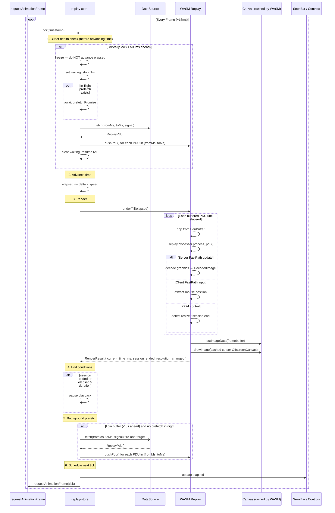

# iron-replay-player

Reusable framework-agnostic web component (`<iron-replay-player>`) for RDP session replay.
Decoding is handled by a WASM engine injected at runtime via the `module` prop.

## Quick start

```html
<script type="module">
  import '@devolutions/iron-replay-player';
  import { init, ReplayBackend } from './iron-replay-player-wasm/IronReplayPlayerWasm.js';

  await init();

  const player = document.querySelector('iron-replay-player');

  // Rich props must be set as JS properties, not HTML attributes
  player.module = ReplayBackend;

  // dataSource is format-agnostic — implement ReplayDataSource for any recording source
  player.dataSource = myDataSource;

  player.addEventListener('ready', (e) => {
    const api = e.detail.playerApi; // PlayerApi
    api.togglePlayback();
  });
</script>

<iron-replay-player style="width: 100%; height: 100%;"></iron-replay-player>
```

> **Important:** `module` and `dataSource` must be set as JS properties on the element instance,
> not as HTML attributes. wasm-bindgen objects cannot be serialised as attribute strings.

## Props

| Prop         | Type               | Description                                                                  |
| ------------ | ------------------ | ---------------------------------------------------------------------------- |
| `dataSource` | `ReplayDataSource` | Data source providing recording PDUs.                                        |
| `module`     | `ReplayModule`     | WASM backend to use for decoding. See [Module injection](#module-injection). |

## ReplayDataSource

The component is format- and transport-agnostic. Consumers implement this interface to supply data from any source (HTTP server, IndexedDB, in-memory buffer, etc.).

```ts
interface ReplayDataSource {
  open(signal?: AbortSignal): Promise<ReplayMetadata>;
  fetch(fromMs: number, toMs: number, signal?: AbortSignal): Promise<ReplayPdu[]>;
  close(): void;
}
```

| Method  | Description                                                                                                              |
| ------- | ------------------------------------------------------------------------------------------------------------------------ |
| `open`  | Returns `ReplayMetadata { durationMs, totalPdus, initialWidth?, initialHeight? }`. Called once when playback is started. |
| `fetch` | Returns `ReplayPdu[]` for the half-open interval `[fromMs, toMs)`, sorted ascending by timestamp.                        |
| `close` | Fire-and-forget cleanup. Called when the component unmounts or when a new recording replaces the current data source.    |

> `close()` may be called after an aborted or rejected `open()` during reload/re-init.
> Implementations should make cleanup idempotent and no-op safely if no resources were allocated.

> **AbortSignal:** During playback the component may issue multiple overlapping
> fetch requests — for example, a seek cancels any pending data requests and
> starts new ones from the seek target. The `signal` passed to `open()` and
> `fetch()` lets the component abort requests that are no longer needed,
> avoiding wasted bandwidth and stale data races.
>
> Implementing it is optional but recommended — pass the signal to native `fetch()`
> and let `AbortError` propagate. If you ignore the signal, everything still works;
> the component discards stale responses internally.
>
> ```ts
> async fetch(fromMs, toMs, signal) {
>   const res = await fetch(`/recording?from=${fromMs}&to=${toMs}`, { signal });
>   return res.json();
> }
> ```

> **Token rotation / auth:** Since the data source is owned by the consumer, handle token refresh
> and authentication inside your `ReplayDataSource` implementation — the component never sees credentials.

## Events

### `ready`

Fired once WASM is initialised and the recording metadata is loaded.
`event.detail.playerApi` exposes the `PlayerApi` for programmatic control.

```ts
player.addEventListener('ready', (e: CustomEvent) => {
  const api: PlayerApi = e.detail.playerApi;
});
```

### `error`

Fired when a data source or WASM operation fails — covers initial load failures,
WASM init failures, and mid-playback fetch/seek failures.
`event.detail` is a `PlayerError`.

```ts
player.addEventListener('error', (e: CustomEvent<PlayerError>) => {
  const err = e.detail;
  console.error(`[${err.phase}] ${err.message}`, err.cause);
});
```

`err.cause` contains the original error thrown by the `ReplayDataSource`.

The error is held until the consumer calls `api.clearError()`. A new error will not
be reported until the previous one is cleared (first-error-wins). The inline error
message inside the component is independent and clears when a new load starts.

## PlayerApi

Returned via the `ready` event. Most methods are synchronous; `load`, `seek`, and `reset` return `Promise<void>`.

| Method           | Signature                                         | Description                                                                           |
| ---------------- | ------------------------------------------------- | ------------------------------------------------------------------------------------- |
| `load`           | `(dataSource: ReplayDataSource) => Promise<void>` | Load a new recording. Resets all playback state.                                      |
| `play`           | `() => void`                                      | Start playback. No-op if already playing.                                             |
| `pause`          | `() => void`                                      | Pause playback. No-op if already paused.                                              |
| `togglePlayback` | `() => void`                                      | Toggle between play and pause.                                                        |
| `seek`           | `(positionMs: number) => Promise<void>`           | Jump to an absolute position in milliseconds.                                         |
| `reset`          | `() => Promise<void>`                             | Seek to position 0, preserving play/pause state.                                      |
| `setSpeed`       | `(speed: number) => void`                         | Set playback speed multiplier (e.g. `1`, `1.5`, `2`, `3`).                            |
| `getSpeed`       | `() => number`                                    | Current playback speed multiplier.                                                    |
| `getElapsedMs`   | `() => number`                                    | Current playhead position in milliseconds.                                            |
| `getDurationMs`  | `() => number`                                    | Total recording duration in milliseconds (`0` if not yet loaded).                     |
| `isPaused`       | `() => boolean`                                   | Whether playback is currently paused.                                                 |
| `getLoadState`   | `() => LoadState`                                 | Current load state. Use to check for errors programmatically after the `ready` event. |
| `getPlayerError` | `() => PlayerError \| null`                       | Current error, or `null` if none active.                                              |
| `clearError`     | `() => void`                                      | Reset the active error. Consumer is responsible for retrying the failed operation.    |

## Module injection

The component has no hard dependency on a specific WASM build. The `ReplayModule` interface
describes what the component needs; the concrete implementation is provided by the
`iron-replay-player-wasm` package, which wraps the compiled `ironrdp-web-replay` crate.

```ts
import type { ReplayModule } from '@devolutions/iron-replay-player';
```

`ReplayModule` requires:

- `Replay` — a class constructable with a `HTMLCanvasElement`, implementing `WasmReplayInstance`
- `PduSource`: an object with readonly numeric `Client` and `Server` values

## Exported types

All public TypeScript types are re-exported from the package entry point:

```ts
import { PduDirection } from '@devolutions/iron-replay-player'; // const: PduDirection.Client, PduDirection.Server
import type {
  ReplayModule, // interface for the WASM backend
  WasmReplayInstance, // interface for a single Replay engine instance
  ReplayDataSource, // interface for supplying recording data
  ReplayMetadata, // { durationMs, totalPdus, initialWidth?, initialHeight? }
  ReplayPdu, // a single PDU with timestamp, direction, and data
  PduDirection, // 0 | 1 — literal union type for PDU direction
  PlayerError, // { message, phase, cause? } — detail of the 'error' event
  PlayerApi, // programmatic control handle (from 'ready' event)
  PlaybackState, // { paused, waiting, seeking }
  LoadState, // 'idle' | 'loading' | 'ready' | { status: 'error', message }
} from '@devolutions/iron-replay-player';
```

## Development

**Prerequisites:** Node.js + npm, Rust toolchain with `wasm-pack` (`cargo xtask wasm install`).

This package sits in a three-step build chain. Run each step from its own directory:

```sh
# Step 1: compile the Rust crate to WASM (run from repo root)
cargo xtask web build-replay

# Step 2: build the WASM JS wrapper
cd web-client/iron-replay-player-wasm && npm run build

# Step 3: build this component library (outputs to dist/)
cd web-client/iron-replay-player && npm run build
```

> `iron-svelte-replay-client/pre-build.js` runs all three steps automatically when you
> run `npm run build` or `npm run dev-all` from that package. You only need to run
> them manually when working on `iron-replay-player` or `iron-replay-player-wasm` directly.

### Type checking

```sh
npm run check            # single run
npm run check:watch      # watch mode
```

### Testing

The test suite has two tiers. See [`tests/README.md`](tests/README.md) for details on test patterns and mocks.

**Unit tests** run in jsdom with fake timers. They test the store state machine and pure utility functions without a browser.

```sh
npm test                 # single run
npm run test:watch       # watch mode
```

**Browser tests** run in real Chromium via Playwright. They test UI interactions (seek bar, keyboard shortcuts, overlays, playback controls) by rendering the full Svelte component.

```sh
# First-time setup: install Playwright browsers
npx playwright install chromium

npm run test:browser              # headless
npm run test:browser:headed       # visible browser for debugging
```

> **CI note:** The replay player is not yet wired into the CI pipeline. Tests must be run locally.

## Recording file format

The recording is a self-contained binary file with three consecutive sections.
All multi-byte integers are **big-endian**.

### Header (20 bytes)

| Offset | Size    | Field       | Description                                                                                                                                     |
| ------ | ------- | ----------- | ----------------------------------------------------------------------------------------------------------------------------------------------- |
| 0      | 4 bytes | `version`   | Header format version (`uint32`)                                                                                                                |
| 4      | 8 bytes | `totalPdus` | Total number of PDUs in the recording (`uint64`)                                                                                                |
| 12     | 8 bytes | `duration`  | Total session duration in milliseconds (`uint64`). May be `0` in some recordings — fall back to the `timeOffset` of the last index table entry. |

### Index table (17 bytes × `totalPdus`)

Immediately follows the header. Each row describes one PDU, enabling random-access
byte-range fetching without scanning the full file.

| Offset | Size    | Field        | Description                                                                                                                           |
| ------ | ------- | ------------ | ------------------------------------------------------------------------------------------------------------------------------------- |
| 0      | 4 bytes | `timeOffset` | Milliseconds since session start (`uint32`)                                                                                           |
| 4      | 4 bytes | `pduLength`  | Length of this PDU in bytes (`uint32`)                                                                                                |
| 8      | 8 bytes | `byteOffset` | Byte offset of this PDU in the file (`uint64`). Parse as `bigint` — values can exceed `Number.MAX_SAFE_INTEGER` for large recordings. |
| 16     | 1 byte  | `direction`  | `0x00` = client→server, `0x01` = server→client                                                                                        |

### PDU data (variable)

Raw binary PDU data, concatenated in index order. Each PDU's position and length
are described by its index table entry.

## Sequence Diagram


